# Angular & Rust AI Full-Stack Template (with Clerk, LiteLLM, & pgvector)

This repository provides a high-performance, production-ready full-stack monorepo boilerplate template integrating a zoneless **Angular 21+** frontend, a memory-safe **Rust Axum 0.8+** backend, **Clerk** authentication, **PostgreSQL with pgvector**, and a containerized **LiteLLM Proxy** with **Redis** caching.

---

## Project Architecture & Tech Stack

### Frontend ([/frontend](file:///home/jvalsesia/Antigravity/angular-rust-clerk/frontend))
*   **Core**: Angular 21+ configured with experimental zoneless change detection and Signal-based state management.
*   **AI Chat**: Real-time Server-Sent Events (SSE) token streaming, model selection, and a context-aware history drawer.
*   **UI Components**: Standalone components styled with a premium dark-mode glassmorphic theme and Angular Material.
*   **Routing**: Angular Router configured with secure route guards gating access to the dashboard.
*   **Testing**: Unit testing powered by **Vitest** with TestBed configuration.

### Backend ([/backend](file:///home/jvalsesia/Antigravity/angular-rust-clerk/backend))
*   **Core**: Axum 0.8+ HTTP web framework targeted to the Rust 2024 Edition.
*   **Runtime**: Tokio multi-threaded asynchronous execution pool.
*   **Security**: Cryptographic Clerk JWT token verification middleware using locally cached public keys (JWKS) with a 24-hour cache TTL.
*   **AI Integrations**: Semantic search via `pgvector` similarity check and direct prompt completions via containerized LiteLLM.
*   **Logging**: Tracing subscriber structured log engine.
*   **Testing**: Oneshot integration testing simulating database states and upstream stream aborts.

### Infrastructure ([docker-compose.yml](file:///home/jvalsesia/Antigravity/angular-rust-clerk/docker-compose.yml))
*   **Database**: PostgreSQL 16 database running the `pgvector` extension.
*   **AI Gateway**: LiteLLM Proxy load-balancing and routing completions requests to OpenAI/Gemini providers.
*   **Caching**: Redis container caching completions to optimize token usage and response times.

---

## Core System User Flow

The sequence diagram below displays the cryptographic token extraction and semantic message flow:

```mermaid
sequenceDiagram
    autonumber
    actor Client as Angular Client
    participant Clerk as Clerk Auth API
    participant Backend as Axum Backend (Rust)
    participant DB as PostgreSQL (pgvector)
    participant LiteLLM as LiteLLM Proxy

    Client->>Clerk: Render Sign-In/Up
    Clerk-->>Client: Auth Success (Get JWT)
    Client->>Backend: Post /api/chat with JWT + prompt + model
    rect rgb(20, 20, 20)
        Note over Clerk, Backend: Token Verification
        Backend->>Clerk: Fetch JWKS (if cached expired)
        Clerk-->>Backend: Return JWKS Keys
        Note over Backend: Verify signature & claims locally
    end
    Backend->>LiteLLM: Fetch prompt embedding vector
    LiteLLM-->>Backend: Return vector (1536 / 768 dims)
    Backend->>DB: Query semantic similarity (cosine distance < 0.3)
    DB-->>Backend: Return top 5 matching past messages
    Backend->>LiteLLM: Forward prompt + context history
    LiteLLM-->>Backend: Stream SSE tokens (event: token)
    Backend-->>Client: Forward SSE stream to Client
    Note over Backend, DB: Save prompt, embedding, and response log to DB
```



---

## Workspace Layout

*   [litellm-config.yaml](file:///home/jvalsesia/Antigravity/angular-rust-clerk/litellm-config.yaml): AI Gateway router and model configuration.
*   [docker-compose.yml](file:///home/jvalsesia/Antigravity/angular-rust-clerk/docker-compose.yml): Multi-container local orchestration layout.
*   [.gitignore](file:///home/jvalsesia/Antigravity/angular-rust-clerk/.gitignore): Ignored folders, build outputs, and environment variables.
*   [.env.example](file:///home/jvalsesia/Antigravity/angular-rust-clerk/.env.example): Root environment variable template.
*   [backend/](file:///home/jvalsesia/Antigravity/angular-rust-clerk/backend): Rust Axum backend workspace.
    *   [backend/src/config.rs](file:///home/jvalsesia/Antigravity/angular-rust-clerk/backend/src/config.rs): Configuration parser for server, Clerk credentials, and DB connections.
    *   [backend/src/db.rs](file:///home/jvalsesia/Antigravity/angular-rust-clerk/backend/src/db.rs): Database connection pool setup, message persistence, and semantic pgvector queries.
    *   [backend/src/lib.rs](file:///home/jvalsesia/Antigravity/angular-rust-clerk/backend/src/lib.rs): Routes initialization, secure endpoint handlers, token cryptographic extractor, and SSE completion streamer.
    *   [backend/src/main.rs](file:///home/jvalsesia/Antigravity/angular-rust-clerk/backend/src/main.rs): Binary server entry point running SQLx migrations at boot.
    *   [backend/migrations/](file:///home/jvalsesia/Antigravity/angular-rust-clerk/backend/migrations): SQL schema migration scripts creating pgvector indexes.
    *   [backend/tests/](file:///home/jvalsesia/Antigravity/angular-rust-clerk/backend/tests): Integration test suites checking secure routes and CORS configurations.
*   [frontend/](file:///home/jvalsesia/Antigravity/angular-rust-clerk/frontend): Angular 21 application workspace.
    *   [frontend/src/app/components/chat/](file:///home/jvalsesia/Antigravity/angular-rust-clerk/frontend/src/app/components/chat): Chat standalone UI component template, logic, and animations.
    *   [frontend/src/app/services/chat.service.ts](file:///home/jvalsesia/Antigravity/angular-rust-clerk/frontend/src/app/services/chat.service.ts): SSE Client Service reading/aborting completion events via `AbortController`.

---

## Environment Setup

1.  **Configure Root Variables**:
    Copy the example template to create your root environment config:
    ```bash
    cp .env.example .env
    ```
    *Edit `.env` to configure your `OPENAI_API_KEY`, `GEMINI_API_KEY` (Google AI Studio key), and Redis caching details.*

2.  **Configure Frontend Variables**:
    Copy the frontend example:
    ```bash
    cp frontend/.env.example frontend/.env
    ```
    *Edit `frontend/.env` to configure your `CLERK_PUBLISHABLE_KEY`.*

3.  **Configure Backend Variables**:
    Copy the backend example:
    ```bash
    cp backend/.env.example backend/.env
    ```
    *Edit `backend/.env` to configure port, database connections, and Clerk crypt keys.*

---

## Running the Application

### Option A: Running with Docker Compose (Recommended)
This runs the entire end-to-end setup (PostgreSQL with pgvector, Redis, LiteLLM Proxy, Axum Backend, and Angular Frontend Nginx server) in isolated containers:

1.  Build and boot all containers:
    ```bash
    docker compose up -d --build
    ```
2.  The application will be served at `http://localhost:4200`. The Axum backend will listen on port `3000`, and the LiteLLM Proxy gateway will listen on port `4000`.
3.  Check container statuses:
    ```bash
    docker compose ps
    ```
4.  View service logs:
    ```bash
    docker compose logs -f litellm
    docker compose logs -f backend
    ```

### Option B: Running Locally (Development Mode)

#### 1. Start Database & AI Infrastructure
You can boot PostgreSQL and LiteLLM/Redis infrastructure inside docker, while running code services locally:
```bash
docker compose up -d db redis litellm
```

#### 2. Run the Backend
1.  Navigate to the backend directory:
    ```bash
    cd backend
    ```
2.  Boot the Axum API server:
    ```bash
    cargo run
    ```

#### 3. Run the Frontend
1.  Navigate to the frontend directory:
    ```bash
    cd frontend
    ```
2.  Install dependencies:
    ```bash
    npm install
    ```
3.  Boot the Angular development server:
    ```bash
    npm run start
    ```
    *The client will be running at `http://localhost:4200` with hot-reloading active.*

---

## Running Tests

### Frontend Tests (Vitest)
Navigate to the `frontend/` directory and execute:
```bash
npm run test
```
*This runs Vitest specs verifying auth route guards, SSE event parsers, and component signals.*

### Backend Tests (Cargo)
Navigate to the `backend/` directory and execute:
```bash
cargo test
```
*This executes unit and integration tests verifying cryptographic token signature decoding, db query vector logic, and SSE cancel drops.*
