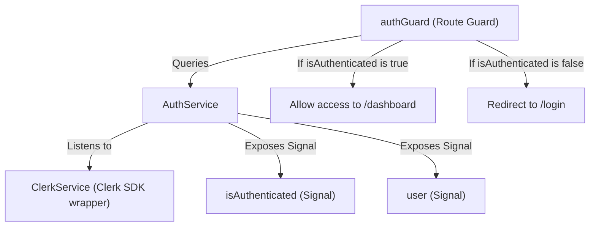

# Technical Specification: F02. Signal-Based Auth State & Route Guard

## 1. Technical Overview

This feature integrates authentication state management and route security into the Angular application using the dynamically loaded Clerk SDK. It establishes a global `AuthService` wrapper that projects Clerk's session status into read-only Angular Signals. It also constructs a functional Angular Route Guard (`authGuard`) to prevent unauthenticated users from accessing the application workspace.

### Scope

**Included:**
*   Global singleton `AuthService` translating Clerk's authentication status into state Signals (`user`, `isAuthenticated`, `isLoaded`).
*   Functional Angular Route Guard (`authGuard`) enforcing session verification on protected paths (such as `/dashboard`).
*   Dynamic navigation handling that coordinates with `ClerkService` load state.
*   Unit tests checking signal states and guard redirect intercepts.

**Deferred (Full Scope additions):**
*   Automatic token refresh interceptor (deferred to `F04`).
*   Multi-tenant authorization checks.

## 2. Architecture Impact

### Affected Components

The following files will be added to the project:
*   `frontend/src/app/services/auth.service.ts`
*   `frontend/src/app/guards/auth.guard.ts`
*   `frontend/src/app/services/auth.service.spec.ts`
*   `frontend/src/app/guards/auth.guard.spec.ts`

### Data Flow Diagram



## 3. Technical Decisions

| Decision | Chosen Approach | Alternative Considered | Trade-off |
|----------|----------------|----------------------|-----------|
| **State Management** | Angular Signals (`signal`, `computed`) | RxJS Observables / BehaviorSubject | Signals provide fine-grained, synchronous state queries which fit natively into Angular's zoneless change detection architecture. |
| **Guard Design** | Functional CanActivate Guard | Class-based CanActivate Guard | Functional guards are the modern, lightweight standard in Angular 15+ and facilitate cleaner dependency injection. |
| **Session Initialization** | Listen to Clerk's session state updates synchronously | Repeated polling of Clerk's loading state | Direct subscription/callback handlers from Clerk minimize UI flickering and render delay. |

## 4. Component Overview

| File Path | New/Modified | Purpose | Key Responsibilities |
|-----------|--------------|---------|---------------------|
| `frontend/src/app/services/auth.service.ts` | New | Auth State Provider | Maps Clerk's session listeners to Angular Signals (`user`, `isAuthenticated`, `isLoaded`). |
| `frontend/src/app/guards/auth.guard.ts` | New | Route Guard | Prevents unauthorized route transitions and redirects to `/login`. |

## 5. API Contracts

### Authentication State Object
```typescript
interface UserProfile {
  id: string;
  fullName: string | null;
  primaryEmailAddress: string | null;
  imageUrl: string;
}
```

## 6. Data Model

*This feature has no database layer or data model specifications.*

## 7. Testing Strategy

### Test Layout

| Test File | Test Type | Target | Coverage Goal |
|-----------|-----------|--------|---------------|
| `frontend/src/app/services/auth.service.spec.ts` | Unit | AuthService Signals | 90% |
| `frontend/src/app/guards/auth.guard.spec.ts` | Unit | Route redirection rules | 90% |

### Test Specifications

*   `AuthService` tests:
    *   Should report `isAuthenticated` as `false` and `isLoaded` as `false` when Clerk is booting.
    *   Should update `isAuthenticated` to `true` and populate `user` signal once Clerk resolves user state.
*   `authGuard` tests:
    *   Should allow route access if user `isAuthenticated` is true.
    *   Should block route access and call `Router.navigate(['/login'])` if user `isAuthenticated` is false.
