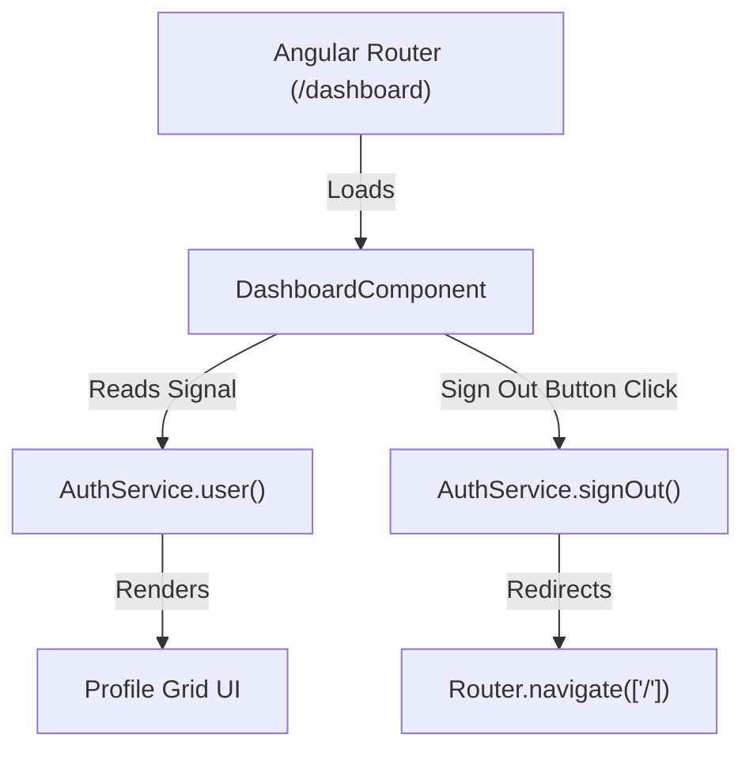

# Technical Specification: F03. Protected Dashboard Component

## 1. Technical Overview

This feature delivers the post-login dashboard view for authenticated users at the `/dashboard` route. It displays user details derived from the active Clerk session via the Angular `AuthService` signals (user ID, full name, email address, avatar image). It also includes a logout action connecting to Clerk's session teardown routines and redirects users back to the landing page.

### Scope

**Included:**
- Premium, modern dashboard layout using custom vanilla CSS glassmorphism styling.
- Dynamically rendered user details (user ID, full name, primary email address, profile picture).
- Logout button trigger executing `AuthService.signOut()` and routing back to `/`.
- Unit tests verifying profile rendering and sign-out click navigation behavior.

**Deferred (Full Scope additions):**
- Real-time profile edits (first/last name updates via Clerk forms).

## 2. Architecture Impact

### Affected Components

The following files will be added or modified:
- `frontend/src/app/components/dashboard/dashboard.component.ts` (new)
- `frontend/src/app/components/dashboard/dashboard.component.html` (new)
- `frontend/src/app/components/dashboard/dashboard.component.css` (new)
- `frontend/src/app/components/dashboard/dashboard.component.spec.ts` (new)
- `frontend/src/app/app.routes.ts` (modified to replace landing page placeholder with the actual component)

### Data Flow Diagram

## 3. Technical Decisions

| Decision | Chosen Approach | Alternative Considered | Trade-off |
|----------|----------------|----------------------|-----------|
| **View Architecture** | Standalone Component | Module-based Component | Standalone components are the standard in Angular 15+, eliminating NgModule overhead and keeping dependencies explicit. |
| **Styling Strategy** | Vanilla CSS Glassmorphism | TailwindCSS utility classes | CSS variables and custom flex grids provide a highly polished, bespoke layout that integrates with the existing landing page theme. |

## 4. Component Overview

| File Path | New/Modified | Purpose | Key Responsibilities |
|-----------|--------------|---------|---------------------|
| `frontend/src/app/components/dashboard/dashboard.component.ts` | New | Controller | Reads profile signals and delegates logout requests. |
| `frontend/src/app/components/dashboard/dashboard.component.html` | New | Template | Renders profile information, avatar images, and logout control triggers. |
| `frontend/src/app/components/dashboard/dashboard.component.css` | New | Styling | Premium layouts featuring deep-blue gradients, card backdrops, and interactive states. |

## 5. API Contracts

*No external API contracts defined; client-side component reads state synchronously from `AuthService` Signals.*

## 6. Data Model

*This feature has no database layer or data model specifications.*

## 7. Testing Strategy

### Test Layout

| Test File | Test Type | Target | Coverage Goal |
|-----------|-----------|--------|---------------|
| `frontend/src/app/components/dashboard/dashboard.component.spec.ts` | Unit | Rendering & Sign Out execution | 90% |

### Test Specifications

- **DashboardComponent tests:**
  - Should render user metadata (full name, email, ID) when logged in.
  - Should call `AuthService.signOut()` and navigate to `/` when clicking logout button.
