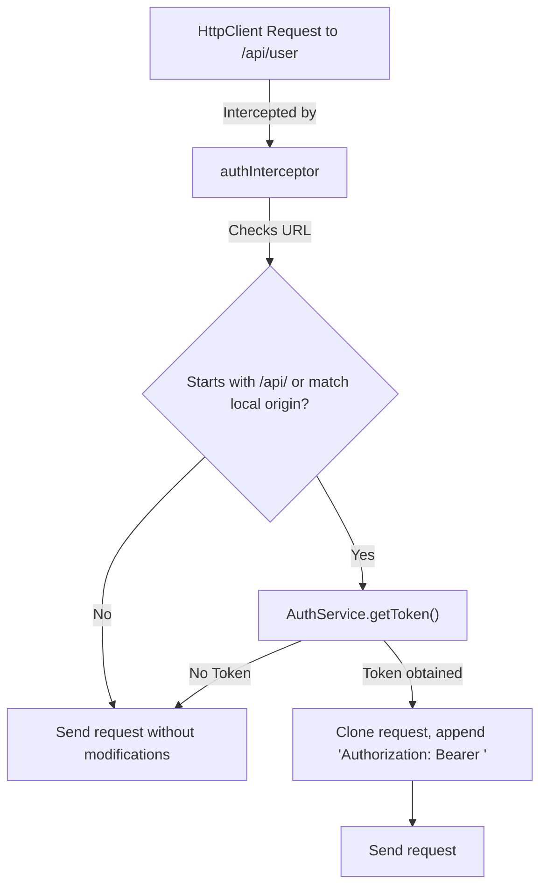

# Technical Specification: F04. Authenticated HTTP Client Interceptor

## 1. Technical Overview

This feature secures communication between the Angular frontend and backend APIs. It constructs a functional HTTP Interceptor (`authInterceptor`) that intercepts outgoing `HttpClient` requests targeting local api paths (`/api/*`), calls `AuthService.getToken()` to fetch Clerk session JWT tokens asynchronously, and prefixes headers with `Authorization: Bearer <token>`.

### Scope

**Included:**
- Functional Angular `HttpInterceptorFn` intercepting `/api/*` requests.
- Asymmetric token attachments (no headers attached on external third-party script URLs).
- Clean handling of unauthenticated endpoints.
- Vitest unit tests verifying token header insertions and exclusions.

**Deferred (Full Scope additions):**
- Auto-retry pipelines on token refresh failures.

## 2. Architecture Impact

### Affected Components

The following files will be added or modified:
- `frontend/src/app/interceptors/auth.interceptor.ts` (new)
- `frontend/src/app/interceptors/auth.interceptor.spec.ts` (new)
- `frontend/src/app/app.config.ts` (modified to register the interceptor within `provideHttpClient`)

### Data Flow Diagram



## 3. Technical Decisions

| Decision | Chosen Approach | Alternative Considered | Trade-off |
|----------|----------------|----------------------|-----------|
| **Interceptor Design** | Functional Interceptor (`HttpInterceptorFn`) | Class-based `HttpInterceptor` implementation | Functional interceptors are native to Angular 15+ and integrate directly into the `provideHttpClient(withInterceptors([...]))` configuration. |
| **Interception Filter** | URL prefix match (`/api/`) | Configuration-based intercept selectors | Direct prefix matching is simple, highly performant, and maps perfectly to our monolithic route design. |

## 4. Component Overview

| File Path | New/Modified | Purpose | Key Responsibilities |
|-----------|--------------|---------|---------------------|
| `frontend/src/app/interceptors/auth.interceptor.ts` | New | Functional Interceptor | Clones matched API requests to inject Clerk's Bearer Authorization header. |

## 5. API Contracts

### Attached Header Format
```http
Authorization: Bearer <clerk_jwt_token_string>
```

## 6. Data Model

*This feature has no database layer or data model specifications.*

## 7. Testing Strategy

### Test Layout

| Test File | Test Type | Target | Coverage Goal |
|-----------|-----------|--------|---------------|
| `frontend/src/app/interceptors/auth.interceptor.spec.ts` | Unit | HttpTestingController mocks | 90% |

### Test Specifications

- **authInterceptor tests:**
  - Should attach `Authorization` header to requests going to `/api/health`.
  - Should NOT attach headers to requests going to external URLs (e.g., `https://api.clerk.com/`).
  - Should pass through requests unmodified if `AuthService.getToken()` resolves to `null`.
