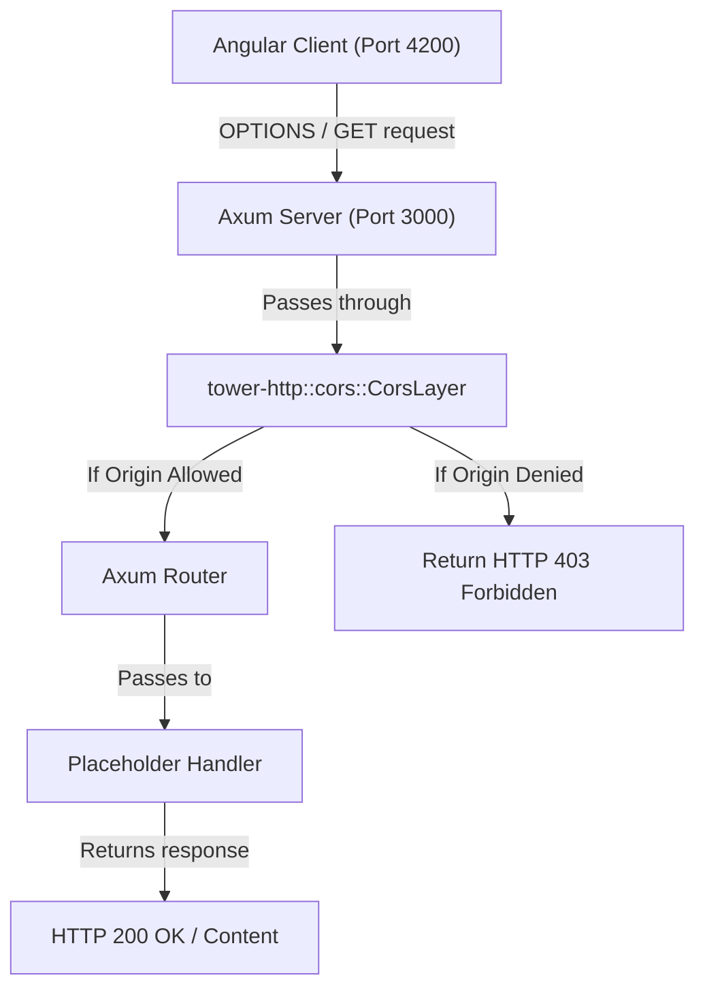

# Technical Specification: F05. Axum Server Scaffolding & CORS

## 1. Technical Overview

This feature establishes the backend foundations of the template monorepo. It constructs a modern backend service inside a new `backend/` directory, using the Rust 2024 Edition cargo layout. The application runtime is powered by `tokio` for high-performance asynchronous execution, and routing is handled by `axum` version 0.8.9.

To support integration with the Angular frontend, this feature configures a Cross-Origin Resource Sharing (CORS) middleware layer using `tower-http`. During development, this middleware ensures that pre-flight `OPTIONS` requests from the frontend origin are correctly parsed and permitted, preventing origin-blocking issues before requests reach the route handling layers.

### Scope

**Included:**
*   Cargo workspace workspace file and local binary project structure targeting Rust 2024 Edition.
*   Setup of `tokio` multi-threaded async runtime.
*   Axum 0.8.9 HTTP server skeleton listening on port `3000` by default.
*   CORS middleware configuration utilizing `tower-http::cors::CorsLayer` to permit local development traffic from `http://localhost:4200`.
*   Application logging initialization using `tracing-subscriber` for developer logs.

**Excluded:**
*   Clerk JWT verification extractor, which will be constructed under `F06`.
*   Protected endpoints and mock data schemas, which will be implemented under `F07`.

## 2. Architecture Impact

### Affected Components

The following files will be added to the project inside the `backend/` workspace:
*   `backend/Cargo.toml`
*   `backend/src/main.rs`
*   `backend/src/config.rs`

### Data Flow Diagram

## 3. Technical Decisions

| Decision | Chosen Approach | Alternative Considered | Trade-off |
|----------|----------------|----------------------|-----------|
| **Async Runtime** | `tokio` (multi-thread feature) | `async-std` or `smol` | Tokio is the industry standard for production-grade async Rust and integrates natively with the Axum web framework. It has a slightly larger footprint than minimal runtimes. |
| **HTTP Framework** | `axum` version 0.8.9 | `actix-web` or `rocket` | Axum fits seamlessly into the Tower middleware ecosystem and utilizes type-safe extractors instead of macros, which aligns with modern compile-time safety targets. |
| **CORS Middleware Setup** | Tower-HTTP `CorsLayer` built-in middleware | Custom manual header manipulation middleware | Using `CorsLayer` ensures compliance with all CORS specifications and handles edge cases automatically, although it introduces a dependency on the `tower-http` crate. |
| **Origin Gating Configuration** | Origins list loaded dynamically from environment variables, fallback to local host | Hardcoded origin strings in code | Environment configurations permit clean cloud deployments without rewriting code, at the expense of needing to manage config assets. |

## 4. Component Overview

| File Path | New/Modified | Purpose | Key Responsibilities |
|-----------|--------------|---------|---------------------|
| `backend/Cargo.toml` | New | Dependency Declarations | Configures packages (tokio, axum 0.8.9, tower-http, tracing) and build settings. |
| `backend/src/main.rs` | New | Application Bootstrapper | Initializes logs, loads configs, applies CORS middleware, binds the socket listener, and runs the server loop. |
| `backend/src/config.rs` | New | Server Configuration Loader | Parses environment variables (PORT, ALLOWED_ORIGINS) and exposes configuration structs. |

## 5. API Contracts

*This feature covers basic server scaffolding. No custom domain endpoints are exposed.*

## 6. Data Model

*This feature has no database layer or data model specifications.*

## 7. Testing Strategy

### Test Layout

| Test File | Test Type | Target | Coverage Goal |
|-----------|-----------|--------|---------------|
| `backend/tests/cors_tests.rs` | Integration | Server CORS policy | 95% |
| `backend/src/config.rs` | Unit | Config defaults and parsing | 90% |

### Test Specifications

| Test Function | Description | Assertions |
|---------------|-------------|------------|
| `test_cors_preflight_success` | Verifies that pre-flight requests from allowed origins return success. | Response code is `200 OK` and CORS header exists. |
| `test_cors_invalid_origin` | Confirms requests from disallowed origins are rejected. | Response header does not permit the origin. |
| `test_config_loading` | Verifies env configuration loads correctly. | Port variable overrides default structure. |
