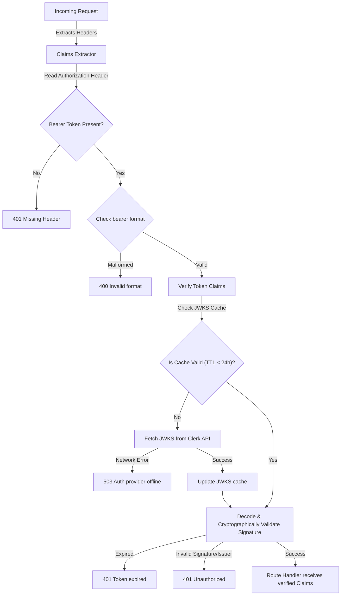

# Technical Specification: F06. Cryptographic Clerk Token Extractor

## 1. Technical Overview

This feature secures Axum endpoints by verifying identity tokens issued by Clerk. It constructs a custom Axum extractor (`Claims`) that intercept requests, pulls the `Authorization: Bearer <token>` header, decodes the payload, and cryptographically checks the signature against Clerk's JSON Web Key Sets (JWKS). To keep API latencies low, the JWKS public keys are cached in memory with a thread-safe cache expiry (TTL) mechanism.

### Scope

**Included:**
*   Axum extractor `struct Claims` implementing `FromRequestParts`.
*   Asynchronous fetching of Clerk's JSON Web Key Sets (JWKS) via `reqwest`.
*   JWKS memory caching using `tokio::sync::RwLock` to hold keys locally for 24 hours.
*   Cryptographic token signature validation utilizing `jsonwebtoken`.
*   Structured error JSON payloads mapping to specific token defects (missing, malformed, expired, offline provider).

**Deferred (Full Scope additions):**
*   Scope-based user permissions checking (roles/groups validation).

## 2. Architecture Impact

### Affected Components

The following files will be added or modified:
*   `backend/Cargo.toml` (already includes dependencies like `serde`, `serde_json`, `reqwest`)
*   `backend/src/claims.rs`
*   `backend/src/lib.rs` (to register routing access tests or export the module)

### Data Flow Diagram



## 3. Technical Decisions

| Decision | Chosen Approach | Alternative Considered | Trade-off |
|----------|----------------|----------------------|-----------|
| **JWT Decoding Library** | `jsonwebtoken` | `biscuit` or custom parsing | `jsonwebtoken` is the industry standard in the Rust community, offering robust support for JWKS-based decoding. |
| **JWKS Fetch Client** | `reqwest` (async client) | `ureq` (blocking client) | `reqwest` integrates natively with Tokio async runtime, preventing thread blockages during key fetches. |
| **JWKS Cache** | In-memory `tokio::sync::RwLock` wrapping keys and timestamp | External Redis cache or fetching on every request | In-memory RwLock is high performance, requires zero external infrastructure, but resets if the application restarts. |

## 4. Component Overview

| File Path | New/Modified | Purpose | Key Responsibilities |
|-----------|--------------|---------|---------------------|
| `backend/src/claims.rs` | New | Claims Extractor & Cryptographic Engine | Extracts and validates the token signature, manages JWKS cache and token expiration. |

## 5. API Contracts

### Decoded Token Claims Structure
```rust
#[derive(Debug, serde::Serialize, serde::Deserialize, Clone)]
pub struct Claims {
    pub sub: String,         // User ID (subject)
    pub email: Option<String>,
    pub exp: u64,            // Expiration timestamp
    pub iss: String,         // Token Issuer url
}
```

### Error Responses

1.  **Missing Header** (HTTP 401 Unauthorized):
    ```json
    { "error": "Missing authorization header" }
    ```
2.  **Malformed Token** (HTTP 400 Bad Request):
    ```json
    { "error": "Invalid authorization format" }
    ```
3.  **Expired Token** (HTTP 401 Unauthorized):
    ```json
    { "error": "Token expired" }
    ```
4.  **JWKS Fetch Failure** (HTTP 503 Service Unavailable):
    ```json
    { "error": "Auth provider offline" }
    ```

## 6. Data Model

*This feature has no database layer or data model specifications.*

## 7. Testing Strategy

### Test Layout

| Test File | Test Type | Target | Coverage Goal |
|-----------|-----------|--------|---------------|
| `backend/src/claims.rs` | Unit | JWT Signature decoding & verification | 90% |

### Test Specifications

*   Should decode valid tokens and populate the `Claims` structure.
*   Should reject expired tokens returning `401 Token expired`.
*   Should reject malformed header strings with `400 Invalid authorization format`.
