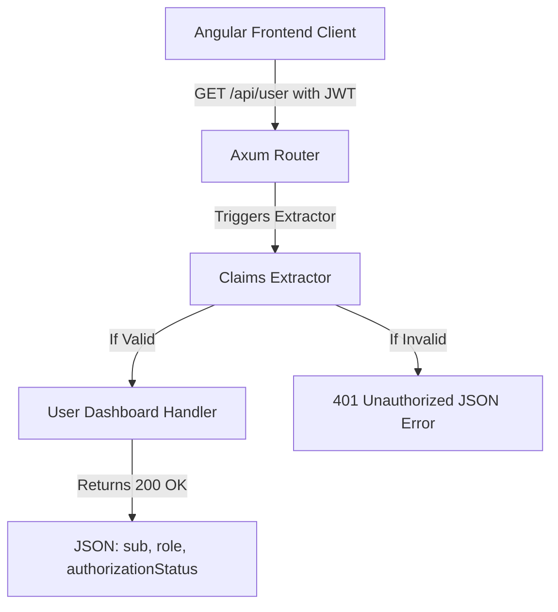

# Technical Specification: F07. Secure User Dashboard API

## 1. Technical Overview

This feature secures Axum backend APIs by introducing a protected endpoint `/api/user`. The route requires authentication and uses the custom `Claims` extractor (implemented in `F06`) to validate Clerk session tokens before serving user-specific dashboard data.

### Scope

**Included:**
- Protected Axum route GET `/api/user` return user dashboard data.
- Extraction and validation of caller identity via the `Claims` extractor.
- Integration tests asserting secure route guards (401 Unauthorized for missing headers, 400 for malformed formatting, 200 OK for valid signatures).

**Deferred (Full Scope additions):**
- Integration with external databases to fetch user profile extensions (deferred to later waves).

## 2. Architecture Impact

### Affected Components

The following files will be added or modified:
- `backend/src/lib.rs` (modified to add the `/api/user` route and wire its handler)
- `backend/tests/secure_routes_tests.rs` (new integration test suite checking endpoint authorization)

### Data Flow Diagram



## 3. Technical Decisions

| Decision | Chosen Approach | Alternative Considered | Trade-off |
|----------|----------------|----------------------|-----------|
| **Handler Implementation** | Async function with `Claims` argument | Middleware layer checking tokens | Placing the `Claims` extractor directly in the handler signature is clean, declarative, and provides direct access to decoded claims. |

## 4. Component Overview

| File Path | New/Modified | Purpose | Key Responsibilities |
|-----------|--------------|---------|---------------------|
| `backend/src/lib.rs` | Modified | App router & handlers | Defines the `get_user_profile` handler and binds it to GET `/api/user`. |

## 5. API Contracts

### GET `/api/user`

**Headers Required:**
```http
Authorization: Bearer <clerk_jwt_token>
```

**Success Response (HTTP 200 OK):**
```json
{
  "subject": "user_12345",
  "status": "authorized",
  "message": "Access granted to secure user dashboard API"
}
```

**Failure Response (HTTP 401 Unauthorized):**
```json
{
  "error": "Missing authorization header"
}
```

## 6. Data Model

*This feature has no database layer or data model specifications.*

## 7. Testing Strategy

### Test Layout

| Test File | Test Type | Target | Coverage Goal |
|-----------|-----------|--------|---------------|
| `backend/tests/secure_routes_tests.rs` | Integration | Route access controls | 90% |

### Test Specifications

- `secure_routes_tests` integration tests:
  - Assert that GET `/api/user` rejects requests lacking the `Authorization` header with `401 Unauthorized`.
  - Assert that GET `/api/user` rejects requests containing non-Bearer headers with `400 Bad Request`.
  - Assert that GET `/api/user` accepts valid signatures and returns the subject ID with `200 OK`.
