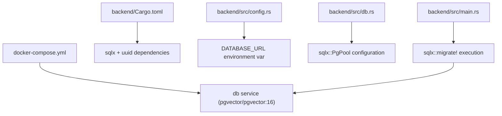

# Technical Specification: PostgreSQL & pgvector Database Setup (F08)

## 1. Technical Overview

### What
This feature implements the PostgreSQL database layer for the full-stack template, enabling the persistent storage of chat sessions, historical message logs, and high-dimensional vector embeddings. It provisions a PostgreSQL container with the `pgvector` extension enabled and configures a runtime migration and connection runner inside the Axum backend using `sqlx`.

### Why
To enable AI semantic search capabilities (in Wave 3), the application requires a persistent storage engine capable of performing fast cosine-similarity searches on vector embeddings. Storing chat logs in relation to Clerk user identities is also necessary to build a personalized user experience.

### Scope

**Included:**
*   Adding a PostgreSQL container to `docker-compose.yml` with `pgvector` pre-installed.
*   Database schema migrations for `chat_sessions`, `chat_messages`, and `chat_embeddings`.
*   Support for both 1536-dimensional (OpenAI) and 768-dimensional (Gemini) embedding vectors.
*   HNSW vector similarity indexes for efficient search performance.
*   Axum backend database connection pool initialization and auto-migration runner at server boot.

**Excluded:**
*   Endpoint routes for querying the database (handled in F10).
*   Calculating text embeddings (handled in F10).

---

## 2. Architecture Impact

### Affected Components

*   `docker-compose.yml` (Modified: add `db` service running pgvector)
*   `backend/Cargo.toml` (Modified: add `sqlx`, `uuid`, and database-specific dependencies)
*   `backend/src/config.rs` (Modified: add database environment variable loading)
*   `backend/src/db.rs` (New: connection pool management)
*   `backend/src/lib.rs` (Modified: expose db module and pass database pool to router state)
*   `backend/src/main.rs` (Modified: initialize database pool and execute migrations)
*   `backend/migrations/20260603000000_init_chat_schema.up.sql` (New: database migration)

### Component Diagram



---

## 3. Technical Decisions

| Decision | Chosen Approach | Alternative Considered | Trade-off |
|----------|----------------|----------------------|-----------|
| **Database Driver** | `sqlx` (asynchronous, compile-time verified SQL) | `diesel` | SQLx compile-time query macros require an active database connection or `sqlx-data.json` schema metadata file during builds, but offer native async support without blocking threads. |
| **Vector Dimension Handling** | Separate table columns (`embedding_1536` and `embedding_768`) in the same table | Dynamic vector width or separate tables | Storing distinct columns keeps queries simple and allows standard HNSW indexes to be built on each column type separately, despite leaving one column NULL per row. |
| **Similarity Index Type** | HNSW (Hierarchical Navigable Small World) index | IVFFlat index | HNSW has higher build-time memory overhead but yields significantly faster query performance and recall accuracy without requiring regular index rebuilding. |
| **Migrations Execution** | Automated migration runner embedded in Rust binary on startup | Manual CLI-driven migrations | Running migrations at application boot simplifies scaffolding deployment and ensures local containers are initialized instantly without manual steps. |

---

## 4. Component Overview

### Backend

| File Path | New/Modified | Purpose | Key Responsibilities |
|-----------|--------------|---------|---------------------|
| `backend/src/config.rs` | Modified | Parse DB environment configurations | Loads `DATABASE_URL` with a secure fallback for local development. |
| `backend/src/db.rs` | New | Database pool management | Configures connection timeouts, pool size, and exports pool initialization helpers. |
| `backend/src/lib.rs` | Modified | Wire up database state | Exposes `db` module and includes `PgPool` in Axum app state. |
| `backend/src/main.rs` | Modified | Startup initialization | Establishes the database pool and executes the embedded `sqlx::migrate!` macro. |

### Database Scaffolding

| Migration File | Tables Affected | Operation | Notes |
|----------------|-----------------|-----------|-------|
| `migrations/20260603000000_init_chat_schema.up.sql` | `chat_sessions`, `chat_messages`, `chat_embeddings` | CREATE | Enables `vector` extension, creates tables, and constructs HNSW cosine similarity indexes. |

---

## 5. API Contracts

*Skip (F08 is purely database and system infrastructure; no direct HTTP endpoints are exposed).*

---

## 6. Data Model

### Table: `chat_sessions`
Stores metadata representing a conversation.

| Column | Type | Nullable | Default | Description |
|--------|------|----------|---------|-------------|
| `id` | `uuid` | No | `gen_random_uuid()` | Primary Key |
| `user_id` | `varchar(255)` | No | - | The Clerk ID of the owning user |
| `title` | `varchar(255)` | No | `'New Chat'` | Conversation title |
| `created_at` | `timestamptz` | No | `now()` | Creation timestamp |

**Indexes:**
*   `ix_chat_sessions_user_id` (btree) on `user_id` - optimizes history retrieval lists.

---

### Table: `chat_messages`
Stores the text contents of the conversation.

| Column | Type | Nullable | Default | Description |
|--------|------|----------|---------|-------------|
| `id` | `uuid` | No | `gen_random_uuid()` | Primary Key |
| `session_id` | `uuid` | No | - | Foreign Key referencing `chat_sessions(id)` |
| `role` | `varchar(50)` | No | - | Message sender (user, assistant, system) |
| `content` | `text` | No | - | The text message payload |
| `message_index` | `integer` | No | - | Index ordering messages within a session |
| `created_at` | `timestamptz` | No | `now()` | Timestamp of creation |

**Indexes:**
*   `ix_chat_messages_session_id_index` (btree) on `(session_id, message_index)` - ensures fast sequential rendering.

---

### Table: `chat_embeddings`
Stores the calculated vectors for user messages.

| Column | Type | Nullable | Default | Description |
|--------|------|----------|---------|-------------|
| `message_id` | `uuid` | No | - | Foreign Key referencing `chat_messages(id)` (Primary Key) |
| `embedding_1536` | `vector(1536)` | Yes | - | Vector storage for OpenAI-compatible models |
| `embedding_768` | `vector(768)` | Yes | - | Vector storage for Gemini-compatible models |

**Indexes:**
*   `ix_chat_embeddings_hnsw_1536` (HNSW) on `embedding_1536 vector_cosine_ops` - Cosine similarity index.
*   `ix_chat_embeddings_hnsw_768` (HNSW) on `embedding_768 vector_cosine_ops` - Cosine similarity index.

**Constraints:**
*   `fk_embedding_message` - Foreign key with `ON DELETE CASCADE` constraint.

---

### Migration SQL Example

```sql
-- Enable the vector extension
CREATE EXTENSION IF NOT EXISTS vector;

-- Create chat sessions table
CREATE TABLE chat_sessions (
    id UUID PRIMARY KEY DEFAULT gen_random_uuid(),
    user_id VARCHAR(255) NOT NULL,
    title VARCHAR(255) NOT NULL DEFAULT 'New Chat',
    created_at TIMESTAMPTZ NOT NULL DEFAULT NOW()
);
CREATE INDEX ix_chat_sessions_user_id ON chat_sessions(user_id);

-- Create chat messages table
CREATE TABLE chat_messages (
    id UUID PRIMARY KEY DEFAULT gen_random_uuid(),
    session_id UUID NOT NULL REFERENCES chat_sessions(id) ON DELETE CASCADE,
    role VARCHAR(50) NOT NULL,
    content TEXT NOT NULL,
    message_index INT NOT NULL,
    created_at TIMESTAMPTZ NOT NULL DEFAULT NOW()
);
CREATE INDEX ix_chat_messages_session_id_index ON chat_messages(session_id, message_index);

-- Create chat embeddings table
CREATE TABLE chat_embeddings (
    message_id UUID PRIMARY KEY REFERENCES chat_messages(id) ON DELETE CASCADE,
    embedding_1536 vector(1536),
    embedding_768 vector(768)
);

-- HNSW Cosine Similarity indexes (requires pgvector)
CREATE INDEX ix_chat_embeddings_hnsw_1536 ON chat_embeddings USING hnsw (embedding_1536 vector_cosine_ops);
CREATE INDEX ix_chat_embeddings_hnsw_768 ON chat_embeddings USING hnsw (embedding_768 vector_cosine_ops);
```

---

## 7. Testing Strategy

### Test File Structure

| Test File | Test Type | Target | Coverage Goal |
|-----------|-----------|--------|---------------|
| `backend/src/db.rs` | Unit | DB pool creation & validation | 100% |
| `backend/tests/db_migrations_tests.rs` | Integration | Schema validation, extension checks | 90% |

### Test Functions

| Test Function | Description | Assertions |
|---------------|-------------|------------|
| `test_db_pool_init` | Verifies database connection pool successfully initializes. | `assert!(pool.is_ok())` |
| `test_pgvector_extension_loaded` | Connects and executes vector calculation to verify pgvector is loaded. | Query `SELECT '[1,2,3]'::vector + '[4,5,6]'::vector` matches expected output |
| `test_runs_migrations` | Boots server in test configuration and validates tables exist in test db. | Tables `chat_sessions`, `chat_messages` are visible in information_schema |
