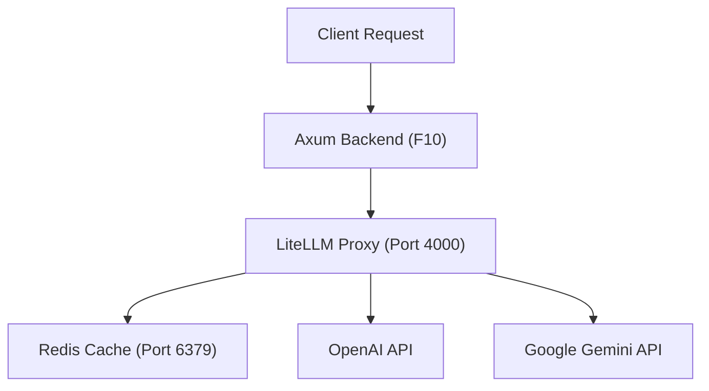

# Technical Specification: LiteLLM Proxy Integration & Upstream Gateway (F09)

## 1. Technical Overview

### What
This feature implements a containerized AI Gateway utilizing `LiteLLM Proxy` backed by a `Redis` cache service. It exposes a unified, OpenAI-compatible API surface for model routing and text embedding generation, abstracting away the communication protocols and key management of multiple upstream providers (OpenAI and Google Gemini).

### Why
By using LiteLLM as an intermediary, the backend only needs to interface with a single API specification (OpenAI completions/embeddings). Upstream LLM keys and model fallbacks are managed at the proxy level. Furthermore, integrating Redis caching intercepts identical prompt requests, reducing external API token consumption and speeding up response times.

### Scope

**Included:**
*   Adding `redis` and `litellm` service containers to the root `docker-compose.yml`.
*   Configuring `litellm-config.yaml` with model routing definitions for OpenAI (`gpt-4o`, `gpt-4o-mini`, `o1-preview`) and Gemini (`gemini-1.5-flash`, `gemini-1.5-pro`, `gemini-2.0-flash`, `gemini-2.5-flash`).
*   Configuring Redis-backed completion caching parameters.
*   Exposing model list, chat completion, and text embedding endpoints on port `4000`.

**Excluded:**
*   Database logging (handled in F10).
*   Streaming SSE connections on backend handlers (handled in F10).

---

## 2. Architecture Impact

### Affected Components

*   `docker-compose.yml` (Modified: add `redis` and `litellm` services, configure network dependency)
*   `litellm-config.yaml` (New: configures LiteLLM model lists, routing, and Redis parameters)
*   `Dockerfile` (New: simple custom Dockerfile for LiteLLM if needed, or direct use of image in docker-compose.yml)
*   `.env` (Modified: add environment variables for API keys and Redis connectivity)

### Component Diagram



---

## 3. Technical Decisions

| Decision | Chosen Approach | Alternative Considered | Trade-off |
|----------|----------------|----------------------|-----------|
| **AI Gateway Tool** | `LiteLLM Proxy` | Direct Rust integrations with multiple SDKs | LiteLLM adds an extra container to the architecture, but eliminates the need to maintain different provider client structures and SSE parser logic in Rust. |
| **Caching Engine** | `Redis` (alpine image) | Memory Cache in LiteLLM | Redis adds a container and network configuration step, but ensures completions remain cached across LiteLLM container restarts and scale-outs. |
| **Routing Strategy** | `simple-shuffle` | `latency-based-routing` | Simple shuffle load balances effectively for development environments, but does not actively query and route based on provider latency benchmarks. |

---

## 4. Component Overview

### Infrastructure

| File Path | New/Modified | Purpose | Key Responsibilities |
|-----------|--------------|---------|---------------------|
| `docker-compose.yml` | Modified | Multi-container orchestration | Configures environment variables, ports, and mounts the configurations for `litellm` and `redis`. |
| `litellm-config.yaml` | New | Model config and routing definitions | Sets up mapping names, defines provider backends, and configures cache parameters. |
| `.env` | Modified | Credentials storage | Stores provider keys (`OPENAI_API_KEY`, `GEMINI_API_KEY`) and connection variables. |

---

## 5. API Contracts

LiteLLM exposes standard OpenAI API endpoints. 

### Endpoint: Create Chat Completion
*   **Method:** POST
*   **Path:** `/v1/chat/completions`
*   **Authentication:** Bearer token (using `LITELLM_MASTER_KEY`)

**Request:**

| Field | Type | Required | Validation | Description |
|-------|------|----------|------------|-------------|
| `model` | `string` | Yes | must match configured model | Target LLM model name |
| `messages` | `array` | Yes | non-empty | Array of message objects (role, content) |
| `stream` | `boolean` | No | default: false | Set true to stream tokens via SSE |

**Request Example:**
```json
{
  "model": "gemini-2.5-flash",
  "messages": [
    {
      "role": "user",
      "content": "Hello! How are you?"
    }
  ],
  "stream": false
}
```

**Response (Success - 200):**

| Field | Type | Description |
|-------|------|-------------|
| `id` | `string` | Completion ID |
| `choices` | `array` | List of output choices containing message text |
| `usage` | `object` | Input/output token usage metrics |

**Response Example:**
```json
{
  "id": "chatcmpl-12345",
  "object": "chat.completion",
  "created": 1677652288,
  "model": "gemini-2.5-flash",
  "choices": [
    {
      "index": 0,
      "message": {
        "role": "assistant",
        "content": "I am doing well, thank you! How can I help you today?"
      },
      "finish_reason": "stop"
    }
  ],
  "usage": {
    "prompt_tokens": 12,
    "completion_tokens": 15,
    "total_tokens": 27
  }
}
```

---

### Endpoint: Create Embeddings
*   **Method:** POST
*   **Path:** `/v1/embeddings`
*   **Authentication:** Bearer token (using `LITELLM_MASTER_KEY`)

**Request:**

| Field | Type | Required | Validation | Description |
|-------|------|----------|------------|-------------|
| `model` | `string` | Yes | must match configured model | Target embedding model |
| `input` | `string` | Yes | non-empty | The text payload to embed |

**Request Example:**
```json
{
  "model": "text-embedding-3-small",
  "input": "Search query text"
}
```

**Response (Success - 200):**

| Field | Type | Description |
|-------|------|-------------|
| `data` | `array` | List containing vector embedding arrays |
| `data[0].embedding` | `array` | The floating-point coordinate vector |

**Response Example:**
```json
{
  "object": "list",
  "data": [
    {
      "object": "embedding",
      "index": 0,
      "embedding": [
        0.002306425,
        -0.00932792,
        0.01579301
      ]
    }
  ],
  "model": "text-embedding-3-small",
  "usage": {
    "prompt_tokens": 3,
    "total_tokens": 3
  }
}
```

---

## 6. Data Model

*Skip (LiteLLM relies on Redis cache key-value store; no schema migrations are managed).*

---

## 7. Testing Strategy

### Test File Structure

| Test File | Test Type | Target | Coverage Goal |
|-----------|-----------|--------|---------------|
| `backend/tests/litellm_gateway_tests.rs` | Integration | Connectivity, routing, caching | 80% |

### Test Functions

| Test Function | Description | Assertions |
|---------------|-------------|------------|
| `test_gateway_health` | Queries `/v1/models` to confirm LiteLLM is online and listing models. | Status is `200 OK`, models array has length > 0 |
| `test_chat_routing_gemini` | Submits mock completion request using `gemini-2.5-flash` model. | Status is `200 OK`, returns text response |
| `test_caching_behavior` | Sends identical request twice and validates if second call returns cached headers. | Response time of second query is < 15ms |
