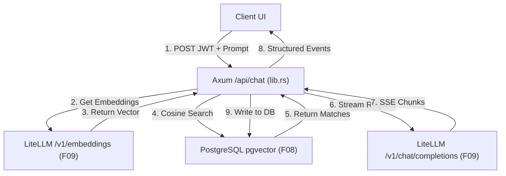

# Technical Specification: Axum AI Chat & Embedding Endpoints (F10)

## 1. Technical Overview

### What
This feature implements the backend AI chat endpoint (`POST /api/chat`) within the Rust Axum application. It handles user authentication, dynamically creates chat sessions, calls LiteLLM Proxy to compute text embeddings, queries the PostgreSQL `pgvector` database for semantic message history, forwards the compiled prompt context to LiteLLM, and streams structured Server-Sent Events (SSE) back to the client.

### Why
To enable a context-aware, low-latency AI conversation experience. Real-time streaming (SSE) reduces perceived latency for the user, while vector search (`pgvector`) retrieves historically relevant messages to provide memory context. Crucially, the endpoint handles client-connection drops gracefully, immediately cancelling upstream requests to save API token costs.

### Scope

**Included:**
*   Adding `LITELLM_URL` and `LITELLM_API_KEY` configurations to the backend.
*   Implementing a protected `POST /api/chat` endpoint requiring Clerk JWT authorization.
*   Generating user prompt embeddings via LiteLLM using models matching the selected LLM provider.
*   Querying the `pgvector` index in PostgreSQL to fetch the top 5 most semantically similar messages.
*   Forwarding combined chat history context to LiteLLM Proxy and streaming tokens back via SSE.
*   Clean cancellation of upstream requests on client disconnect using `tokio::select!`.
*   Persisting both user prompts and generated AI completions to the database.

**Excluded:**
*   Frontend UI layout and components (handled in F11).
*   Mocking tests in non-database suites (tests are isolated in integration modules).

---

## 2. Architecture Impact

### Affected Components

*   `backend/src/config.rs` (Modified: add LiteLLM config parameters)
*   `backend/src/lib.rs` (Modified: add chat endpoint route, register state handler)
*   `backend/.env` / `.env.example` (Modified: add LiteLLM config variables)

### Component Diagram



---

## 3. Technical Decisions

| Decision | Chosen Approach | Alternative Considered | Trade-off |
|----------|----------------|----------------------|-----------|
| **Embedding Generation** | Outsource to LiteLLM Proxy using standard models | Load local ONNX runtime models inside Rust | Outsourcing introduces a small network call overhead to the gateway, but eliminates the need to compile and package heavy PyTorch/ONNX runtimes inside the Rust container. |
| **Stream Interception & Cleanup** | `tokio::select!` monitoring client connection cancellation | Active polling or stream timeouts | Tokio select cleanly interrupts the async thread and drops the upstream request on connection drop, at the cost of a slightly more complex handler implementation. |
| **SSE Event Architecture** | Structured JSON events (`session_created`, `context`, `token`, `error`, `done`) | Raw string stream | Structured events require parsing on the client, but allow returning multiple data shapes (e.g. newly created session IDs and retrieved context blocks) over the same stream. |
| **History Fallback** | Fallback to last 10 chronological messages on embedding failure | Return error status to client | Falling back ensures the user can continue their chat session even if the embedding generation is experiencing temporary network degradation. |

---

## 4. Component Overview

### Backend

| File Path | New/Modified | Purpose | Key Responsibilities |
|-----------|--------------|---------|---------------------|
| `backend/src/config.rs` | Modified | Configuration properties | Loads `LITELLM_URL` and `LITELLM_API_KEY` configurations. |
| `backend/src/lib.rs` | Modified | Route handler and logic | Implements `POST /api/chat`, manages DB queries, calculates similarity, and streams SSE results. |

---

## 5. API Contracts

### Endpoint: AI Chat Stream
*   **Method:** POST
*   **Path:** `/api/chat`
*   **Authentication:** JWT Bearer
*   **Headers:** `Accept: text/event-stream`

**Request:**

| Field | Type | Required | Validation | Description |
|-------|------|----------|------------|-------------|
| `session_id` | `uuid / null` | Yes | must be valid UUID or null | Existing chat session ID |
| `prompt` | `string` | Yes | non-empty | User message payload |
| `model` | `string` | Yes | must match configured model list | The LLM model choice |

**Request Example:**
```json
{
  "session_id": null,
  "prompt": "Explain Quantum Computing simply.",
  "model": "gemini-2.5-flash"
}
```

**SSE Response Stream Events:**

#### 1. `session_created` (pushed ONLY if request `session_id` was null)
```
event: session_created
data: {"session_id": "550e8400-e29b-41d4-a716-446655440000"}
```

#### 2. `context` (pushed once, contains top 5 semantically matched past messages)
```
event: context
data: [{"role": "user", "content": "What is superposition?"}, {"role": "assistant", "content": "Superposition is..."}]
```

#### 3. `token` (pushed repeatedly for each text chunk)
```
event: token
data: {"text": "Quantum "}
```

#### 4. `done` (pushed once to close connection)
```
event: done
data: {}
```

#### 5. `error` (pushed on failure)
```
event: error
data: {"error": "AI Gateway offline"}
```

---

## 6. Data Model

*Skip (F10 interacts with the tables defined in F08; it does not implement database schema migrations).*

---

## 7. Testing Strategy

### Test File Structure

| Test File | Test Type | Target | Coverage Goal |
|-----------|-----------|--------|---------------|
| `backend/tests/chat_endpoint_tests.rs` | Integration | Endpoints, SSE, database logging | 80% |

### Test Functions

| Test Function | Description | Assertions |
|---------------|-------------|------------|
| `test_chat_stream_success` | Mock LiteLLM via `wiremock` and send valid token. Checks SSE chunks. | Status is `200 OK`, response starts with stream, first event is `context` or `session_created` |
| `test_chat_creates_session` | Sends request with `session_id: null` and verifies database registers a new session. | Database has a new session row matching the returned ID |
| `test_stream_cancel_on_disconnect` | Simulates client connection abort and checks if mock server registers request termination. | Wiremock registers client socket close, tokio loop drops the connection |
| `test_embedding_failure_fallback` | Simulates embedding API timeout and checks fallback to chronological history. | Stream completes successfully utilizing last messages from DB |
