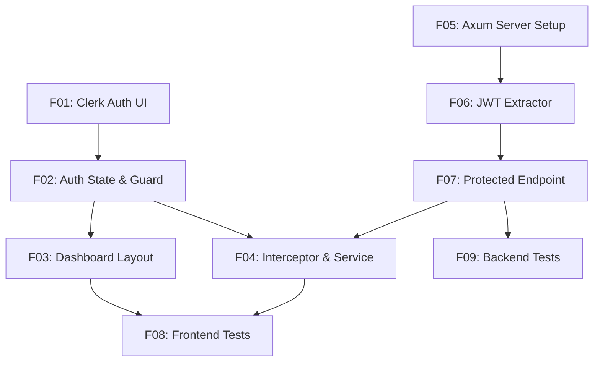

# Modern Full-Stack Template (Angular + Axum + Clerk)

## 1. Executive Summary

This product is a modern, high-performance, ultra-secure full-stack boilerplate template designed for software developers and engineering teams. It provides a pre-configured architectural foundation for building web applications that require a highly reactive frontend and a blazingly fast, memory-safe backend. By combining Angular 21+ and Rust Axum 0.8.9 in a monorepo, developers can bypass weeks of integration and configuration overhead.

At its core, the template implements fully zoneless Angular change detection powered by Signals on the frontend and type-safe HTTP routing using Tokio and Axum on the backend. Authentication and identity management are entirely offloaded to Clerk, using a custom cryptographic JWT verification layer written in Rust to protect API endpoints without introducing third-party runtime dependencies.

The template includes a fully functional, gated dashboard layout using Angular Material, automated token injection on HTTP requests, and ready-to-run testing suites for both the frontend (via Vitest) and backend (via Axum integration tests). This project serves as a turn-key solution to jumpstart production-ready, cloud-deployable full-stack applications.

## 2. Problem and Opportunity

### The Problem

*   **High Scaffolding Overhead:** Developers spend 15 to 40 hours configuring standard monorepos, routing guards, CORS policies, and security extractors before writing business logic.
*   **Authentication Complexity:** Implementing secure, cryptographic JWT verification locally using hosted identity provider configurations (like Clerk) is error-prone, especially in Rust where official SDKs are scarce.
*   **Performance Bottlenecks:** Traditional frontend frameworks struggle with change-detection cycles, and heavy backend runtimes consume excessive CPU and memory under load, leading to slower page speeds.
*   **Lack of Testing Alignment:** Setting up modern test runners like Vitest with Angular, alongside Rust integration testing, requires complex, custom configuration that is often omitted.

### The Opportunity

This boilerplate template solves these challenges by delivering a pre-configured, tested repository layout. It eliminates the standard setup time, reducing onboarding to under 5 minutes. By verifying Clerk tokens cryptographically using locally cached public keys (JWKS), it ensures backend calls remain sub-millisecond without network round-trip overhead on every request. Combining Angular's zoneless Signals architecture with Axum's compile-time safety and lightweight memory footprint delivers a boilerplate that achieves superior performance benchmarks straight out of the box.

## 3. Target Audience

### Primary Users

**Full-Stack Web Developers**
*   Needs a fast, modern starting point for client projects without spending time on auth wiring.
*   Values compile-time safety in Rust and modern reactivity paradigms in Angular.
*   Requires a responsive, ready-to-customize UI structure.

**Tech Leads & Architects**
*   Wants to enforce consistent coding standards, modern architectural patterns, and testing coverage across team projects.
*   Prefers lightweight, zero-overhead cloud deployments with minimal maintenance surface area.
*   Demands robust, cryptographically validated endpoint security using Clerk.

### Behavioral Profile

All target users are technical practitioners who prioritize developer experience, fast execution speeds, clean build pipelines, and structured monorepo layouts. They work primarily in CLI environments, rely heavily on hot-reloading for rapid feedback loops, and expect modular, well-commented codebases.

## 4. Objectives

*   **Reduce Scaffolding Time:** Enable developers to run a fully functional, authenticated, local end-to-end development environment in under 5 minutes.
*   **Achieve Zero-Overhead Reactivity:** Utilize Angular 21+ zoneless change detection to completely remove Zone.js, reducing runtime change detection cycles to 0 when data is static.
*   **Deliver Sub-Millisecond Authorization:** Ensure the Rust Axum JWT verification extractor processes incoming tokens cryptographically in less than 1.0 milliseconds.
*   **Enforce High Test Coverage:** Provide boilerplate test templates ensuring a baseline of at least 80% code coverage for both frontend services and protected backend endpoints.

## 5. User Stories

### F01. Landing Page & Clerk Auth UI
*   As a visitor, I want to view a responsive landing page with a clear value proposition so that I understand what the app does.
*   As a visitor, I want to click a sign-in or sign-up button so that I can access the authentication modal or page.
*   As a registering user, I want to fill in my details in the Clerk interface so that I can create a secure account.

### F02. Signal-Based Auth State & Route Guard
*   As a logged-in user, I want the system to store my auth state in an Angular Signal so that UI elements react instantly to my status.
*   As a visitor, I want the system to block me from accessing `/dashboard` and redirect me to `/login` so that my private data is protected.
*   As an authenticated user, I want to navigate directly to `/dashboard` without being blocked.

### F03. Angular Material Dashboard Layout
*   As a logged-in user, I want a persistent top toolbar displaying my profile picture, name, and a sign-out button so that I can manage my session.
*   As a logged-in user, I want a responsive left sidebar navigation menu so that I can switch between dashboard pages easily.
*   As a mobile user, I want the sidebar to collapse gracefully so that the interface remains readable on small screens.

### F04. JWT HTTP Interceptor & Client Data Service
*   As the system, I want to automatically inject my Clerk JWT token into the headers of all outbound HTTP calls to `/api/*` so that I do not write auth logic for every service call.
*   As a logged-in user, I want the dashboard to fetch protected data and show a loading spinner so that I know the system is working.

### F05. Axum Server Scaffolding & CORS
*   As a developer, I want a structured Axum 0.8.9 server configuration running on Tokio so that I can build scalable HTTP services.
*   As a developer, I want CORS policies pre-configured to accept requests from the Angular port during local development.

### F06. Cryptographic Clerk Token Extractor
*   As the system, I want to intercept requests, extract JWTs from the `Authorization: Bearer` header, and cryptographically verify them using Clerk's JWKS so that unauthorized requests are rejected immediately.
*   As the system, I want to cache the Clerk JWKS public keys in memory for up to 24 hours so that I avoid calling Clerk's API on every request.

### F07. Protected Mock Endpoint
*   As an authorized frontend client, I want to call `/api/protected` and receive a mock message and server timestamp so that I can verify backend communication.
*   As the system, I want to return a 401 Unauthorized status code if an invalid or missing token is presented to `/api/protected`.

### F08. Frontend Unit Testing (Vitest)
*   As a developer, I want to execute unit tests using Vitest in under 2 seconds so that I can quickly verify frontend service and component functionality.

### F09. Backend Integration Testing
*   As a developer, I want to run integration tests that spin up a test Axum server and verify route guards so that I ensure backend APIs remain secure.

## 6. Functionalities

### F01. Landing Page & Clerk Auth UI

**Capabilities:**
*   Renders a static, responsive landing page using modern vanilla styling.
*   Integrates Clerk SPA SDK (v5+ or latest compatible JS bundle) to load components.
*   Embeds `<clerk-sign-in>` and `<clerk-sign-up>` inside custom wrapper components mapping to `/login` and `/register` routes.
*   Maximum initial load time for the Clerk login widget must be under 1.5 seconds under standard 3G connections.

**Experience:**
*   A user arriving at `/` sees a landing layout with a "Get Started" call-to-action button.
*   Clicking "Get Started" redirects the user to `/login`, which displays the embedded Clerk login container.
*   During Clerk widget loading, a Material spinner is centered on screen.
*   Once logged in, Clerk triggers a redirect callback to `/dashboard`.

**Error Handling:**
*   If Clerk SDK fails to initialize within a 10-second timeout, the login route displays an error card reading: *"Authentication Service Unavailable. Please check your network connection and reload."*
*   If the user closes the sign-in modal/action prematurely, they are returned to the home route.

---

### F02. Signal-Based Auth State & Route Guard

**Capabilities:**
*   Creates a global, singleton `AuthService` wrapping Clerk’s authentication state.
*   Exposes a read-only Signal: `isAuthenticated = computed(() => ...)` and user profile details.
*   Implements an Angular functional Route Guard `authGuard` checking the state of the Signal.
*   Redirect delay when routing an authenticated user must be under 50 milliseconds.

**Experience:**
*   If an unauthenticated user attempts to access `/dashboard` directly, the guard cancels the navigation and redirects to `/login`.
*   If the user is logged in, access is granted without visual flicker or layout shifts.

**Error Handling:**
*   If the guard encounters an unresolved auth state (e.g., Clerk is still fetching session state), it waits for the Signal to update, displaying a global loading screen for a maximum of 5 seconds before defaulting to unauthorized redirection.

---

### F03. Angular Material Dashboard Layout

**Consumes:**
*   Authentication state and user profile metadata (picture, display name) from Clerk.

**Capabilities:**
*   Uses Angular Material `mat-sidenav-container`, `mat-sidenav`, `mat-toolbar`, and `mat-nav-list`.
*   Includes a responsive sidebar toggle. The sidebar collapses into a hidden drawer menu when screen width is less than 768 pixels.
*   Top toolbar features: App Title, User Profile Avatar, and an interactive Sign Out button.

**Experience:**
*   On desktop screens (>768px wide), the sidebar is open by default. Clicking the menu icon in the toolbar toggles the sidebar's open/collapsed state.
*   On mobile screens (<768px wide), the sidebar is hidden and slides out overlay-style when the menu icon is tapped.
*   Clicking the Sign Out button initiates Clerk's logout sequence, showing a clean overlay saying *"Signing out..."* before redirecting to `/`.

---

### F04. JWT HTTP Interceptor & Client Data Service

**Consumes:**
*   Mock protected response data (message body, server timestamp) from F07.

**Provides:**
*   Mock protected response data (message body, server timestamp) (used by F03).

**Capabilities:**
*   Implements an Angular functional `HttpInterceptor` that intercepts requests to `/api/*`.
*   Retrieves Clerk session token asynchronously and appends it as `Authorization: Bearer <JWT>` header.
*   Implements a `DataService` containing a `getProtectedData()` method calling backend endpoint `/api/protected`.

**Experience:**
*   When a user clicks "Fetch Data" inside the dashboard layout, a loader indicator appears.
*   The HTTP request is made with the attached JWT.
*   Once the backend responds, the loader is replaced with the payload: the protected message and timestamp.

---

### F05. Axum Server Scaffolding & CORS

**Capabilities:**
*   Axum 0.8.9 server configuration targeted to Rust 2024 Edition.
*   Tokio runtime integration running asynchronous tasks.
*   Configures CORS middleware using `tower-http::cors::CorsLayer` specifically allowing `GET`, `POST`, `OPTIONS` methods, and headers (`Content-Type`, `Authorization`).
*   Pre-configured local development server port set to `3000`.

**Experience:**
*   Upon launch (`cargo run`), the console outputs tracing logs: `INFO [server] Listening on http://127.0.0.1:3000`.
*   Responds to standard HTTP requests and preflight `OPTIONS` requests gracefully.

---

### F06. Cryptographic Clerk Token Extractor

**Provides:**
*   Decoded Claims (user_id, email, roles) (used by F07).

**Capabilities:**
*   Implements a custom Axum extractor `struct Claims` which implements `FromRequestParts`.
*   Decodes and validates the JWT signature using `jsonwebtoken` or `jsonwebtoken::DecodingKey` from Clerk's JWKS.
*   Caches the JWKS response in memory using a thread-safe structure (e.g., `arc-swap` or `tokio::sync::RwLock`) with a TTL of 24 hours to prevent repetitive API calls to Clerk.
*   Rejects tokens if `exp` time is in the past or `iss` (issuer) does not match the Clerk configured instance.

**Error Handling:**
*   **Missing Header:** If the request lacks the `Authorization` header, returns HTTP `401 Unauthorized` with JSON payload: `{"error": "Missing authorization header"}`.
*   **Malformed Token:** If header does not begin with `Bearer `, returns HTTP `400 Bad Request` with payload: `{"error": "Invalid authorization format"}`.
*   **Expired Signature:** If JWT signature is expired, returns HTTP `401 Unauthorized` with payload: `{"error": "Token expired"}`.
*   **JWKS Fetch Failure:** If the backend fails to contact Clerk to fetch JWKS (network issue), returns HTTP `503 Service Unavailable` with payload: `{"error": "Auth provider offline"}`.

---

### F07. Protected Mock Endpoint

**Consumes:**
*   Decoded Claims containing user details (specifically: `user_id`, `email`, and `roles`) from F06.

**Provides:**
*   Mock protected response data (message body, server timestamp) (used by F04).

**Capabilities:**
*   Exposes a route `GET /api/protected` using Axum routing.
*   Extracts the verified token using the custom `Claims` extractor.
*   Returns a JSON payload: `{"message": "Hello from Axum!", "user_id": "<ID>", "timestamp": 1780290000}`.

**Experience:**
*   Returns JSON status `200 OK` on successful validation.
*   Returns `401 Unauthorized` directly if the `Claims` extractor fails, before execution reaches the handler logic.

---

### F08. Frontend Unit Testing (Vitest)

**Capabilities:**
*   Includes Vitest configuration matching Analog/Angular Vite setup.
*   Provides test specs (`*.spec.ts`) for components and services, achieving a minimum line coverage of 80%.
*   Configured to mock HTTP requests via `HttpTestingController`.

---

### F09. Backend Integration Testing

**Capabilities:**
*   Includes a `tests/` directory with integration tests.
*   Spins up a local test instance of the Axum app on an ephemeral port.
*   Performs HTTP client calls using `reqwest` to mock protected endpoints.
*   Includes tests verifying that invalid tokens fail and valid/mocked structures pass validation.

## 7. Out of Scope

*   **Database Integration:** No persistent databases (SQL/NoSQL) are configured. All state is mocked in memory or ephemeral.
*   **Multi-tenant Organization Admin:** Gating UI or API based on Clerk's complex organization permissions/hierarchies is left to subsequent feature development.
*   **Custom Login Templates:** Custom HTML overrides for the Clerk sign-in form; the template relies on Clerk's standard modal/embedded component presentation.
*   **Production SSL Setup:** Setting up local SSL certs (HTTPS) is out of scope; the boilerplate relies on standard proxy servers for production SSL termination.

## 8. Dependency Graph

### Part 1: Dependency Table

| # | Feature | Priority | Dependencies |
|---|---------|----------|--------------|
| F01 | Landing Page & Clerk Auth UI | 1 | None |
| F02 | Signal-Based Auth State & Route Guard | 1 | F01 |
| F03 | Angular Material Dashboard Layout | 2 | F02 |
| F05 | Axum Server Scaffolding & CORS | 1 | None |
| F06 | Cryptographic Clerk Token Extractor | 1 | F05 |
| F07 | Protected Mock Endpoint | 1 | F06 |
| F04 | JWT HTTP Interceptor & Client Data Service | 2 | F02, F07 |
| F08 | Frontend Unit Testing (Vitest) | 3 | F03, F04 |
| F09 | Backend Integration Testing | 3 | F07 |

### Part 2: Foundation Features

These features set up shared project infrastructure. In a greenfield project, they must be implemented sequentially before or alongside any feature that depends on them:
*   **F01 Landing Page & Clerk Auth UI** — Configures the root Angular 21 project workspace scaffolding, zoneless settings, and initial Clerk SPA SDK integration.
*   **F05 Axum Server Scaffolding & CORS** — Configures the Cargo workspace root, initializes the base Axum 0.8.9 application, sets up the Tokio runtime, and wires standard cors middleware.

### Part 3: Execution Waves

Features within the same wave can be built in parallel. A wave starts only after every feature in earlier waves is complete.

**Note:** When the "Foundation Features" part is present, foundation features cannot run in parallel in a greenfield project even if they appear together in a wave — they share scaffolding files and must be implemented sequentially until the base is in place.

*   **Wave 1**: F01, F05
*   **Wave 2**: F02, F06
*   **Wave 3**: F07, F03
*   **Wave 4**: F04, F09
*   **Wave 5**: F08

### Part 4: Priority Levels

*   **1** = Essential — product does not work without it
*   **2** = Important — significant value addition
*   **3** = Desirable — incremental improvement

### Part 5: Mermaid Diagram

## 9. Acceptance Criteria

### F01. Landing Page & Clerk Auth UI
*   `GET /` returns HTTP 200 OK and renders the Landing Page.
*   `GET /login` displays the Clerk login widget wrapper.
*   Clerk widgets (Sign-in/Sign-up) display within 1.5 seconds of mounting on desktop and mobile.
*   Login failure shows a distinct warning card component with user feedback.

### F02. Signal-Based Auth State & Route Guard
*   The `AuthService.isAuthenticated` read-only Signal accurately matches Clerk's session state.
*   Navigating to `/dashboard` when `isAuthenticated` is `false` automatically redirects the user to `/login` within 50ms.
*   Navigating to `/dashboard` when `isAuthenticated` is `true` loads the dashboard screen successfully.

### F03. Angular Material Dashboard Layout
*   On viewport widths $\ge$ 768px, the sidebar is visible beside the main content.
*   On viewport widths $<$ 768px, the sidebar is collapsed and toggles only as an overlay drawer.
*   The Toolbar correctly exhibits the logged-in user's profile image and display name.
*   Clicking "Sign Out" calls Clerk's logout and redirects to `/`.

### F04. JWT HTTP Interceptor & Client Data Service
*   Outbound HTTP requests to `/api/*` automatically contain an `Authorization` header containing the JWT token.
*   The `DataService.getProtectedData()` returns an Observable emitting the payload.
*   If the token is invalid, the request fails with standard error propagation.

### F05. Axum Server Scaffolding & CORS
*   Running `cargo run` starts the server on port 3000 and prints startup tracing messages.
*   The server responds to CORS preflight `OPTIONS` requests from `http://localhost:4200` with HTTP 200 OK and correct headers.

### F06. Cryptographic Clerk Token Extractor
*   Axum rejects requests to endpoints utilizing the `Claims` extractor with HTTP 401 if the `Authorization` header is missing.
*   Axum rejects requests with HTTP 400 if the `Authorization` header format is malformed (no `Bearer ` prefix).
*   JWKS keys are loaded once and successfully cached, preventing network calls to Clerk on subsequent requests within 24 hours.

### F07. Protected Mock Endpoint
*   A request with a cryptographically valid Clerk JWT token returns HTTP 200 OK and a JSON payload containing `message`, `user_id`, and `timestamp`.
*   A request with an expired or invalid signature returns HTTP 401 Unauthorized.

### F08. Frontend Unit Testing (Vitest)
*   Running `npm run test` executes all frontend tests using Vitest.
*   Total line coverage for `AuthService`, `authGuard`, and `DataService` is $\ge$ 80%.

### F09. Backend Integration Testing
*   Running `cargo test` executes the Axum integration tests.
*   Integration tests verify success (200 OK) for mock-token routes and failure (401 Unauthorized) for tokenless requests.

### Cross-Feature Integration

*   **F03 to F04 Integration:** Verify that `mat-sidenav` main content area correctly receives and renders the message body and server timestamp from `DataService.getProtectedData()` on user action.
*   **F04 to F07 Integration:** Verify that the frontend `DataService.getProtectedData()` call correctly formats the HTTP GET request matching `/api/protected`'s route and receives the `message` and `timestamp` fields.
*   **F07 to F06 Integration:** Verify that the `/api/protected` route handler receives a correctly populated `Claims` struct containing matching `user_id`, `email`, and `roles` parsed from the validated token.
