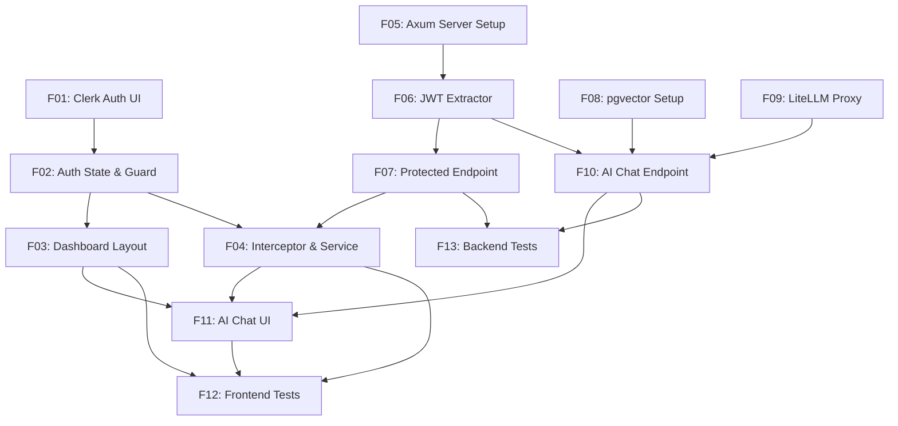

# Modern Full-Stack Template (Angular + Axum + Clerk + LiteLLM Proxy + pgvector)

## 1. Executive Summary

This product is a modern, high-performance, ultra-secure full-stack boilerplate template designed for software developers and engineering teams. It provides a pre-configured architectural foundation for building web applications that require a highly reactive frontend, a memory-safe backend, and turnkey AI integration. By combining Angular 21+, Rust Axum 0.8+, Clerk authentication, PostgreSQL with pgvector, and a containerized LiteLLM Proxy in a monorepo, developers can bypass weeks of integration and configuration overhead.

At its core, the template implements fully zoneless Angular change detection powered by Signals on the frontend, and type-safe HTTP routing using Tokio and Axum on the backend. Authentication is offloaded to Clerk, using a custom cryptographic JWT verification layer written in Rust to protect API endpoints. An integrated AI gateway (LiteLLM Proxy cached via Redis) supports multiple LLM providers. User prompts are embedded, stored, and searched semantically inside a PostgreSQL database using pgvector, enabling intelligent, historical message retrieval.

The template includes a fully functional, gated dashboard layout, an AI streaming chat component with a dynamic model selector, automated token injection on HTTP requests, and ready-to-run testing suites for both the frontend (Vitest) and backend (Axum integration tests). This project serves as a turn-key solution to jumpstart production-ready, cloud-deployable full-stack applications with advanced AI capabilities.

## 2. Problem and Opportunity

### The Problem

*   **High Scaffolding Overhead:** Developers spend 20 to 60 hours configuring monorepos, database connections, CORS policies, and security extractors before writing business logic.
*   **Authentication Integration Complexity:** Implementing secure, cryptographic JWT verification locally using hosted identity provider configurations (like Clerk) is error-prone, especially in Rust where official SDKs are scarce.
*   **AI Gateway & Streaming Configuration Bottlenecks:** Configuring multiple upstream LLM provider API keys, managing Server-Sent Events (SSE) streaming connections, and implementing clean connection-drop handling requires complex backend development.
*   **Context-Aware Chat Persistence Gap:** Setting up vector databases for storing chat history and implementing semantic similarity search (embeddings + pgvector) is a major hurdle for developers building intelligent apps.

### The Opportunity

This boilerplate template solves these challenges by delivering a pre-configured, tested repository layout. It eliminates standard setup time, reducing local environment startup to under 5 minutes. By verifying Clerk tokens cryptographically using locally cached public keys (JWKS), it ensures backend calls remain sub-millisecond without network round-trips on every request. Integrating PostgreSQL with pgvector enables out-of-the-box semantic search over chat histories, utilizing the appropriate embedding model based on the user's selected LLM. Finally, a containerized LiteLLM Proxy with Redis caching simplifies LLM key management and load balancing.

## 3. Target Audience

### Primary Users

**Full-Stack Web Developers**
*   Needs a fast, modern starting point for client projects without spending time on auth and AI streaming wiring.
*   Values compile-time safety in Rust, modern reactivity paradigms in Angular, and containerized Docker environments.
*   Requires a responsive, ready-to-customize UI structure.

**AI Application Architects**
*   Wants to enforce consistent coding standards, modern architectural patterns, and testing coverage across team projects.
*   Requires a secure, scalable way to connect frontend clients to multiple upstream LLM providers (e.g., Anthropic, OpenAI, Gemini) through a single gateway.
*   Demands robust, vector-based chat history persistence and semantic retrieval capabilities.

### Behavioral Profile

All target users are technical practitioners who prioritize developer experience, fast execution speeds, clean build pipelines, and structured monorepo layouts. They work primarily in CLI environments, rely heavily on hot-reloading for rapid feedback loops, and expect modular, well-commented codebases.

## 4. Objectives

*   **Reduce Scaffolding Time:** Enable developers to run a fully functional, authenticated, database-backed local end-to-end development environment in under 5 minutes.
*   **Achieve Zero-Overhead Reactivity:** Utilize Angular 21+ zoneless change detection to completely remove Zone.js, reducing runtime change detection cycles to 0 when data is static.
*   **Deliver Sub-Millisecond Authorization:** Ensure the Rust Axum JWT verification extractor processes incoming tokens cryptographically in less than 1.0 milliseconds.
*   **Enable Fast Semantic Chat Retrieval:** Retrieve semantically relevant historical chat messages from the pgvector database in less than 100 milliseconds.
*   **Enforce High Test Coverage:** Provide boilerplate test templates ensuring a baseline of at least 80% code coverage for both frontend services and protected backend endpoints.

## 5. User Stories

### F01. Landing Page & Clerk Auth UI
*   As a visitor, I want to view a responsive landing page with a clear value proposition so that I understand what the app does.
*   As a visitor, I want to click a sign-in or sign-up button so that I can access the authentication modal or page.
*   As a registering user, I want to fill in my details in the Clerk interface so that I can create a secure account.

### F02. Signal-Based Auth State & Route Guard
*   As a logged-in user, I want the system to store my auth state in an Angular Signal so that UI elements react instantly to my status.
*   As a visitor, I want the system to block me from accessing `/dashboard` and redirect me to `/login` so that my private data is protected.
*   As an authenticated user, I want to navigate directly to `/dashboard` without being blocked.

### F03. Angular Material Dashboard Layout
*   As a logged-in user, I want a persistent top toolbar displaying my profile picture, name, and a sign-out button so that I can manage my session.
*   As a logged-in user, I want a responsive left sidebar navigation menu so that I can switch between dashboard pages (including AI Chat) easily.
*   As a mobile user, I want the sidebar to collapse gracefully so that the interface remains readable on small screens.

### F04. JWT HTTP Interceptor & Client Data Service
*   As the system, I want to automatically inject my Clerk JWT token into the headers of all outbound HTTP calls to `/api/*` so that I do not write auth logic for every service call.
*   As a logged-in user, I want the dashboard to fetch protected data and show a loading spinner so that I know the system is working.

### F05. Axum Server Scaffolding & CORS
*   As a developer, I want a structured Axum 0.8+ server configuration running on Tokio so that I can build scalable HTTP services.
*   As a developer, I want CORS policies pre-configured to accept requests from the Angular port during local development.

### F06. Cryptographic Clerk Token Extractor
*   As the system, I want to intercept requests, extract JWTs from the `Authorization: Bearer` header, and cryptographically verify them using Clerk's JWKS so that unauthorized requests are rejected immediately.
*   As the system, I want to cache the Clerk JWKS public keys in memory for up to 24 hours so that I avoid calling Clerk's API on every request.

### F07. Protected Mock Endpoint
*   As an authorized frontend client, I want to call `/api/protected` and receive a mock message and server timestamp so that I can verify backend communication.
*   As the system, I want to return a 401 Unauthorized status code if an invalid or missing token is presented to `/api/protected`.

### F08. PostgreSQL & pgvector Database Setup
*   As a developer, I want a pre-configured PostgreSQL service container with the `pgvector` extension enabled so that I can store embeddings and relational data.
*   As the system, I want to run migrations at startup to automatically create chat sessions, message tables, and vector similarity indexes.

### F09. LiteLLM Proxy Integration & Upstream Gateway
*   As a developer, I want a LiteLLM Proxy container with Redis caching configured via docker-compose so that my API requests are load-balanced and cached.
*   As a developer, I want to configure multiple LLM models (OpenAI, Gemini) in a single config file so that I do not hardcode provider SDKs.

### F10. Axum AI Chat & Embedding Endpoints
*   As an authorized client, I want to send a prompt and a model name to `/api/chat` and receive a streamed SSE response so that the AI response renders progressively.
*   As the system, I want to detect client disconnection during chat streaming and abort the upstream LiteLLM call immediately so that I conserve API tokens.
*   As the system, I want to automatically generate embeddings for prompts and store all messages in the PostgreSQL database.
*   As a logged-in user, I want to query a semantic search endpoint to retrieve past messages with similar meaning.

### F11. Angular AI Chat & Model Selector UI
*   As a logged-in user, I want to select my desired LLM model from a dropdown menu before starting a conversation.
*   As a logged-in user, I want to type a prompt in a reactive form, submit it, and see the AI response stream in real time.
*   As a logged-in user, I want to see a list of semantically retrieved relevant past messages in a side panel to help me recall context.

### F12. Frontend Unit Testing (Vitest)
*   As a developer, I want to execute unit tests using Vitest in under 2 seconds so that I can quickly verify frontend service and component functionality.

### F13. Backend Integration Testing
*   As a developer, I want to run integration tests that spin up a test Axum server, mock the database, and verify auth/chat routes.

## 6. Functionalities

### F01. Landing Page & Clerk Auth UI

**Capabilities:**
*   Renders a static, responsive landing page using modern vanilla CSS.
*   Integrates Clerk SPA SDK to load sign-in and sign-up widgets.
*   Embeds `<clerk-sign-in>` and `<clerk-sign-up>` inside custom wrapper components mapping to `/login` and `/register` routes.
*   Maximum initial load time for the Clerk login widget must be under 1.5 seconds under standard 3G connections.

**Experience:**
*   A user arriving at `/` sees a landing layout with a "Get Started" call-to-action button.
*   Clicking "Get Started" redirects the user to `/login`, which displays the embedded Clerk login container.
*   During Clerk widget loading, a Material spinner is centered on screen.
*   Once logged in, Clerk triggers a redirect callback to `/dashboard`.

**Error Handling:**
*   If Clerk SDK fails to initialize within a 10-second timeout, the login route displays an error card reading: *"Authentication Service Unavailable. Please check your network connection and reload."*
*   If the user closes the sign-in modal/action prematurely, they are returned to the home route.

---

### F02. Signal-Based Auth State & Route Guard

**Capabilities:**
*   Creates a global, singleton `AuthService` wrapping Clerk’s authentication state.
*   Exposes a read-only Signal: `isAuthenticated = computed(() => ...)` and user profile details.
*   Implements an Angular functional Route Guard `authGuard` checking the state of the Signal.
*   Redirect delay when routing an authenticated user must be under 50 milliseconds.

**Experience:**
*   If an unauthenticated user attempts to access `/dashboard` directly, the guard cancels the navigation and redirects to `/login`.
*   If the user is logged in, access is granted without visual flicker or layout shifts.

**Error Handling:**
*   If the guard encounters an unresolved auth state (e.g., Clerk is still fetching session state), it waits for the Signal to update, displaying a global loading screen for a maximum of 5 seconds before defaulting to unauthorized redirection.

---

### F03. Angular Material Dashboard Layout

**Capabilities:**
*   Uses Angular Material layout elements (`mat-sidenav-container`, `mat-sidenav`, `mat-toolbar`, and `mat-nav-list`).
*   Includes a responsive sidebar toggle. The sidebar collapses into a hidden drawer menu when screen width is less than 768 pixels.
*   Top toolbar features: App Title, User Profile Avatar, and an interactive Sign Out button.

**Experience:**
*   On desktop screens (>768px wide), the sidebar is open by default. Clicking the menu icon in the toolbar toggles the sidebar's open/collapsed state.
*   On mobile screens (<768px wide), the sidebar is hidden and slides out overlay-style when the menu icon is tapped.
*   Clicking the Sign Out button initiates Clerk's logout sequence, showing a clean overlay saying *"Signing out..."* before redirecting to `/`.

---

### F04. JWT HTTP Interceptor & Client Data Service

**Consumes:**
*   F07: mock protected response data (message body, server timestamp)

**Provides:**
*   Mock protected response data (message body, server timestamp) (used by F03)

**Capabilities:**
*   Implements an Angular functional `HttpInterceptor` that intercepts requests to `/api/*`.
*   Retrieves Clerk session token asynchronously and appends it as `Authorization: Bearer <JWT>` header.
*   Implements a `DataService` containing a `getProtectedData()` method calling backend endpoint `/api/protected`.

**Experience:**
*   When a user clicks "Fetch Data" inside the dashboard layout, a loader indicator appears.
*   The HTTP request is made with the attached JWT.
*   Once the backend responds, the loader is replaced with the payload: the protected message and timestamp.

---

### F05. Axum Server Scaffolding & CORS

**Capabilities:**
*   Axum 0.8+ server configuration targeted to Rust 2024 Edition.
*   Tokio runtime integration running asynchronous tasks.
*   Configures CORS middleware using `tower-http::cors::CorsLayer` specifically allowing `GET`, `POST`, `OPTIONS` methods, and headers (`Content-Type`, `Authorization`).
*   Pre-configured local development server port set to `3000`.

**Experience:**
*   Upon launch (`cargo run`), the console outputs tracing logs: `INFO [server] Listening on http://127.0.0.1:3000`.
*   Responds to standard HTTP requests and preflight `OPTIONS` requests gracefully.

---

### F06. Cryptographic Clerk Token Extractor

**Capabilities:**
*   Implements a custom Axum extractor `struct Claims` which implements `FromRequestParts`.
*   Decodes and validates the JWT signature using `jsonwebtoken` or `jsonwebtoken::DecodingKey` from Clerk's JWKS.
*   Caches the JWKS response in memory using a thread-safe structure with a TTL of 24 hours to prevent repetitive API calls to Clerk.
*   Rejects tokens if `exp` time is in the past or `iss` (issuer) does not match the Clerk configured instance.

**Error Handling:**
*   **Missing Header:** If the request lacks the `Authorization` header, returns HTTP `401 Unauthorized` with JSON payload: `{"error": "Missing authorization header"}`.
*   **Malformed Token:** If header does not begin with `Bearer `, returns HTTP `400 Bad Request` with payload: `{"error": "Invalid authorization format"}`.
*   **Expired Signature:** If JWT signature is expired, returns HTTP `401 Unauthorized` with payload: `{"error": "Token expired"}`.
*   **JWKS Fetch Failure:** If the backend fails to contact Clerk to fetch JWKS (network issue), returns HTTP `503 Service Unavailable` with payload: `{"error": "Auth provider offline"}`.

---

### F07. Protected Mock Endpoint

**Provides:**
*   Mock protected response data (message body, server timestamp) (used by F04)

**Capabilities:**
*   Exposes a route `GET /api/protected` using Axum routing.
*   Extracts the verified token using the custom `Claims` extractor.
*   Returns a JSON payload: `{"message": "Hello from Axum!", "user_id": "<ID>", "timestamp": 1780290000}`.

**Experience:**
*   Returns JSON status `200 OK` on successful validation.
*   Returns `401 Unauthorized` directly if the `Claims` extractor fails, before execution reaches the handler logic.

---

### F08. PostgreSQL & pgvector Database Setup

**Provides:**
*   Database tables schema for chat sessions and message embeddings (used by F10)

**Capabilities:**
*   PostgreSQL 16+ Docker container running the `pgvector` extension.
*   Database schema defines three primary tables: `chat_sessions` (id, user_id, title, created_at), `chat_messages` (id, session_id, role, content, message_index, created_at), and `chat_embeddings` (message_id, embedding vector(1536/768 depending on model)).
*   Startup database migration runner using `sqlx` to auto-initialize the database and verify connectivity within 5 seconds of server startup.

**Experience:**
*   Upon startup, the Axum server checks the database connection.
*   If tables are missing, it executes migration scripts sequentially and outputs `INFO [db] Migration successfully completed.`
*   If pgvector is not installed, it attempts to enable it with `CREATE EXTENSION IF NOT EXISTS vector;`.

**Error Handling:**
*   **Database Connection Failure:** If Axum fails to establish a connection to PostgreSQL after 5 retries, the server halts with error log: `FATAL [db] Database connection could not be established. Halting server.`
*   **Migration Failure:** If a migration script fails, the application aborts and rolls back the current transaction, logging the migration error.

---

### F09. LiteLLM Proxy Integration & Upstream Gateway

**Provides:**
*   OpenAI-compatible API endpoints for chat completions and embeddings (used by F10)

**Capabilities:**
*   Containerized LiteLLM Proxy running on port `4000`, configured via `litellm-config.yaml`.
*   Redis Alpine container enabled for caching completions, saving redundant token costs.
*   Exposes unified OpenAI-compatible endpoints: `/v1/chat/completions` and `/v1/embeddings`.
*   Supported models list: `gpt-4o`, `gpt-4o-mini`, `o1-preview`, `gemini-1.5-flash`, `gemini-1.5-pro`, `gemini-2.0-flash`, `gemini-2.5-flash`.

**Experience:**
*   LiteLLM starts up and connects to Redis (`litellm-redis` on port `6379`).
*   Requests sent to `http://litellm:4000` are routed to either OpenAI or Gemini APIs, based on model parameters, utilizing keys defined in local environment variables.

---

### F10. Axum AI Chat & Embedding Endpoints

**Consumes:**
*   F08: database tables schema for chat sessions and message embeddings
*   F09: OpenAI-compatible API endpoints for chat completions and embeddings

**Provides:**
*   Streamed chat tokens (used by F11)
*   Semantically retrieved message history (used by F11)

**Core Scope:**
*   Exposes `POST /api/chat` which accepts a JSON payload containing `session_id`, `prompt`, and `model`.
*   Generates prompt embeddings via LiteLLM using the embedding model corresponding to the selected provider (e.g., `text-embedding-3-small` for OpenAI, `text-embedding-004` for Gemini).
*   Queries `pgvector` to fetch the top 5 most semantically similar messages within the user's history using cosine distance (`<=>`).
*   Sends the chat history context + prompt to LiteLLM Proxy and streams the response via Server-Sent Events (SSE).
*   Saves the user prompt and the fully completed assistant response as separate rows in PostgreSQL.

**Full Scope additions:**
*   Implements `tokio::select!` in the stream handler. If the HTTP client aborts connection (e.g. closes tab), it detects cancellation and immediately halts the upstream LiteLLM streaming connection to save token consumption.

**Capabilities:**
*   Supports streaming SSE output format `text/event-stream`.
*   Cosine distance similarity retrieval threshold set to `0.7`.
*   Embedding generation SLA must be under 300ms.
*   Chat response streaming connection must initiate within 500ms of request.

**Experience:**
*   An authenticated request to `/api/chat` triggers JWT validation.
*   The system queries similarity matches, formats the model payload, and starts pushing event chunks: `data: {"content": "..."}`.
*   Once finished, it outputs a closing event token and writes the payload to PostgreSQL.

**Error Handling:**
*   **Embedding Failure:** If the embedding API call fails or times out, the backend logs the warning and falls back to a standard non-semantic retrieval of the last 10 messages from the database, proceeding with the chat completion.
*   **LiteLLM API Offline:** If LiteLLM Proxy is unreachable, the endpoint returns HTTP `502 Bad Gateway` with payload `{"error": "AI Gateway is temporarily offline. Please try again later."}`.
*   **Database Write Failure:** If saving messages to the database fails, the SSE stream continues to run to preserve user experience, but logs `ERROR [db] Failed to persist chat message.`

---

### F11. Angular AI Chat & Model Selector UI

**Consumes:**
*   F10: streamed chat tokens, semantically retrieved message history

**Capabilities:**
*   Includes a chat panel component containing: a model selector dropdown, a chat history window, and a message entry input.
*   Dropdown option values: `gpt-4o-mini` (default), `gpt-4o`, `o1-preview`, `gemini-2.5-flash`, `gemini-1.5-flash`, `gemini-1.5-pro`.
*   Uses Angular Signals exclusively (`chatHistory = signal<Message[]>([])`, `selectedModel = signal('gpt-4o-mini')`, `isStreaming = signal(false)`) to drive UI updates in a zoneless environment.
*   Fetches and renders semantically matched past messages in a collapsible "Relevant Context" side drawer.

**Experience:**
*   The user navigates to `/dashboard/chat` (gated via `authGuard`).
*   The user selects a model, types a prompt, and hits enter.
*   A user message card is appended to the UI. The input is disabled, and `isStreaming` is set to `true`.
*   The client connects to `/api/chat` using standard HTTP POST, receiving chunked fragments and appending them to the active AI message signal.
*   The "Relevant Context" panel populates with semantic matches returned by the backend.

---

### F12. Frontend Unit Testing (Vitest)

**Capabilities:**
*   Provides Vitest configuration integrating with Analog/Angular Vite settings.
*   Achieves a minimum code coverage of 80% for the chat client service and model selector logic.
*   Mocks streaming HTTP endpoints and handles event stream response testing.

---

### F13. Backend Integration Testing

**Capabilities:**
*   Cargo integration tests executing against a mock database configuration.
*   Mocks the LiteLLM network socket utilizing `wiremock` to simulate successful and failed SSE streaming responses.
*   Validates that the Axum handler terminates upstream streams upon connection abort.

## 7. Out of Scope

*   **Multi-User Shared Workspaces:** Shared channels or collaborative sessions are not supported; chat history is strictly isolated per individual Clerk User ID.
*   **Dynamic Agent Tool Call execution:** The system acts as a direct prompt-to-response router. Executing local scripts or operating system tools dynamically (Function Calling / ReAct loops) is out of scope.
*   **Local File Upload Processing (RAG with PDFs):** Document upload, local file chunking, parsing, and vector ingestion on a per-user basis is excluded. The semantic search queries only historical chat text.
*   **Production SSL Configuration:** Setting up local HTTPS/SSL certs (e.g. mkcert/nginx) inside docker-compose is left to deployment pipeline proxies.

## 8. Dependency Graph

### Part 1: Dependency Table

| # | Feature | Priority | Dependencies |
|---|---------|----------|--------------|
| F01 | Landing Page & Clerk Auth UI | 1 | None |
| F02 | Signal-Based Auth State & Route Guard | 1 | F01 |
| F03 | Angular Material Dashboard Layout | 2 | F02 |
| F05 | Axum Server Scaffolding & CORS | 1 | None |
| F06 | Cryptographic Clerk Token Extractor | 1 | F05 |
| F07 | Protected Mock Endpoint | 1 | F06 |
| F04 | JWT HTTP Interceptor & Client Data Service | 2 | F02, F07 |
| F08 | PostgreSQL & pgvector Database Setup | 1 | None |
| F09 | LiteLLM Proxy Integration & Upstream Gateway | 1 | None |
| F10 | Axum AI Chat & Embedding Endpoints | 1 | F06, F08, F09 |
| F11 | Angular AI Chat & Model Selector UI | 2 | F03, F04, F10 |
| F12 | Frontend Unit Testing (Vitest) | 3 | F03, F04, F11 |
| F13 | Backend Integration Testing | 3 | F07, F10 |

### Part 2: Foundation Features

These features set up shared project infrastructure. In a greenfield project, they must be implemented sequentially before or alongside any feature that depends on them:
*   **F01 Landing Page & Clerk Auth UI** — Configures the root Angular 21 project workspace scaffolding, zoneless settings, and initial Clerk SPA SDK integration.
*   **F05 Axum Server Scaffolding & CORS** — Configures the Cargo workspace root, initializes the base Axum application, sets up the Tokio runtime, and wires standard CORS middleware.
*   **F08 PostgreSQL & pgvector Database Setup** — Provisions the database container, builds connection pooling infrastructure inside Rust, and manages schema tables.

### Part 3: Execution Waves

Features within the same wave can be built in parallel. A wave starts only after every feature in earlier waves is complete.

**Note:** Foundation features (see "Foundation Features" above) cannot run in parallel in a greenfield project even if they appear together in a wave — they share scaffolding files and must be implemented sequentially until the base is in place.

*   **Wave 1**: F01, F05, F08, F09
*   **Wave 2**: F02, F06
*   **Wave 3**: F07, F10, F03
*   **Wave 4**: F04, F13
*   **Wave 5**: F11
*   **Wave 6**: F12

### Part 4: Priority levels

*   **1** = Essential — product does not work without it
*   **2** = Important — significant value addition
*   **3** = Desirable — incremental improvement

### Part 5: Mermaid Diagram

## 9. Acceptance Criteria

### F01. Landing Page & Clerk Auth UI
*   `GET /` returns HTTP 200 OK and renders the Landing Page.
*   `GET /login` displays the Clerk login widget wrapper.
*   Clerk widgets (Sign-in/Sign-up) display within 1.5 seconds of mounting on desktop and mobile.
*   Login failure shows a distinct warning card component with user feedback.

### F02. Signal-Based Auth State & Route Guard
*   The `AuthService.isAuthenticated` read-only Signal accurately matches Clerk's session state.
*   Navigating to `/dashboard` when `isAuthenticated` is `false` automatically redirects the user to `/login` within 50ms.
*   Navigating to `/dashboard` when `isAuthenticated` is `true` loads the dashboard screen successfully.

### F03. Angular Material Dashboard Layout
*   On viewport widths $\ge$ 768px, the sidebar is visible beside the main content.
*   On viewport widths $<$ 768px, the sidebar is collapsed and toggles only as an overlay drawer.
*   The Toolbar correctly exhibits the logged-in user's profile image and display name.
*   Clicking "Sign Out" calls Clerk's logout and redirects to `/`.

### F04. JWT HTTP Interceptor & Client Data Service
*   Outbound HTTP requests to `/api/*` automatically contain an `Authorization` header containing the JWT token.
*   The `DataService.getProtectedData()` returns an Observable emitting the payload.
*   If the token is invalid, the request fails with standard error propagation.

### F05. Axum Server Scaffolding & CORS
*   Running `cargo run` starts the server on port 3000 and prints startup tracing messages.
*   The server responds to CORS preflight `OPTIONS` requests from `http://localhost:4200` with HTTP 200 OK and correct headers.

### F06. Cryptographic Clerk Token Extractor
*   Axum rejects requests to endpoints utilizing the `Claims` extractor with HTTP 401 if the `Authorization` header is missing.
*   Axum rejects requests with HTTP 400 if the `Authorization` header format is malformed (no `Bearer ` prefix).
*   JWKS keys are loaded once and successfully cached, preventing network calls to Clerk on subsequent requests within 24 hours.

### F07. Protected Mock Endpoint
*   A request with a cryptographically valid Clerk JWT token returns HTTP 200 OK and a JSON payload containing `message`, `user_id`, and `timestamp`.
*   A request with an expired or invalid signature returns HTTP 401 Unauthorized.

### F08. PostgreSQL & pgvector Database Setup
*   The database container starts up, enables the `vector` extension, and completes all tables migrations.
*   If Postgres is offline, the Axum application logs connection retry statements and terminates with exit code 1 after 5 unsuccessful attempts.

### F09. LiteLLM Proxy Integration & Upstream Gateway
*   LiteLLM container starts successfully, listens on port 4000, and connects to Redis.
*   Requests directed to `/v1/models` return a JSON list containing the configured models: `gpt-4o`, `gpt-4o-mini`, `o1-preview`, `gemini-1.5-flash`, `gemini-1.5-pro`, `gemini-2.0-flash`, `gemini-2.5-flash`.

### F10. Axum AI Chat & Embedding Endpoints
*   Sending a prompt to `POST /api/chat` with a valid JWT initiates an SSE stream starting within 500ms.
*   Prompt and assistant response content are correctly stored in the database.
*   Closing the client connection during streaming halts upstream network events to LiteLLM in less than 200ms.
*   If embedding generation fails, the system falls back to standard chronological history retrieval.

### F11. Angular AI Chat & Model Selector UI
*   Selecting a model from the dropdown updates the chat request payload parameter on subsequent submissions.
*   Incoming SSE events stream chunk-by-chunk and render progressively in the chat log container.
*   The "Relevant Context" sidebar displays the retrieved semantic message list, linking matching texts to their database session records.

### F12. Frontend Unit Testing (Vitest)
*   Running `npm run test` executes all frontend tests using Vitest.
*   Total line coverage for the chat component and model selection services is $\ge$ 80%.

### F13. Backend Integration Testing
*   Running `cargo test` executes backend integration tests.
*   Integration tests mock LiteLLM and verify that the stream aborts correctly when a client cancels a request.

### Cross-Feature Integration

*   **F03 to F04 Integration:** Verify that `mat-sidenav` main content area correctly receives and renders the message body and server timestamp from `DataService.getProtectedData()` on user action.
*   **F04 to F07 Integration:** Verify that the frontend `DataService.getProtectedData()` call correctly formats the HTTP GET request matching `/api/protected`'s route and receives the `message` and `timestamp` fields.
*   **F10 to F08 Integration:** Verify that `/api/chat` successfully executes SQL statements to insert session metadata and query pgvector for matching embeddings.
*   **F10 to F09 Integration:** Verify that `/api/chat` successfully calls LiteLLM Proxy endpoints (`/v1/chat/completions` and `/v1/embeddings`) with the correct model and token payloads.
*   **F11 to F10 Integration:** Verify that the chat component establishes an SSE stream from `/api/chat`, parsing the event buffer and appending chunks directly to the UI Signal.
