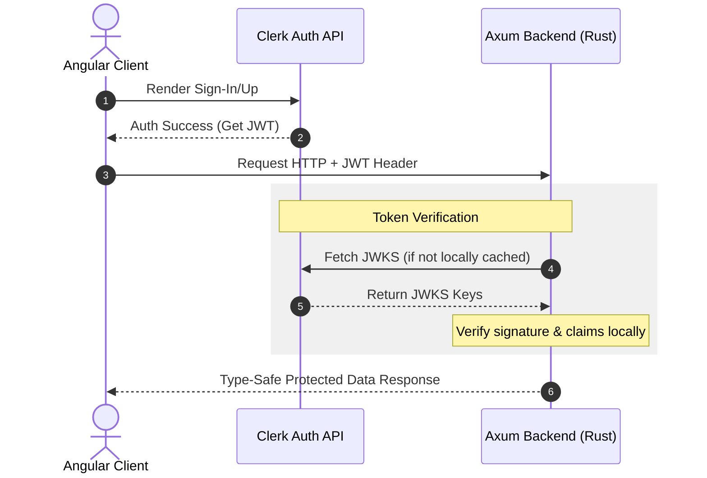

# Project Intent: Modern Full-Stack Template (Angular + Axum + Clerk)

## 1. Project Overview

The objective of this project is to build a high-performance, ultra-secure, full-stack boilerplate application. This project serves as an architectural blueprint for combining modern frontend reactivity with blazingly fast, memory-safe backend execution.

### Key Objectives

* **Zero-Overhead Reactivity:** Leverage Angular’s latest native Signals and zoneless architecture.
* **Compile-Time Type Safety:** Utilize Axum’s macro-free, type-safe extractor routing mechanism.
* **Turnkey Authentication:** Offload identity management, sign-ins, and sign-ups completely to Clerk.

---

## 2. Architectural Design & Tech Stack

### Frontend (Angular 21+)

* **Reactivity:** Fully **Zoneless change detection** powered exclusively by **Angular Signals**.
* **Build Pipeline:** Vite-powered modern `application` builder (replacing traditional Webpack setups).
* **Testing:** **Vitest** for blistering fast, modern unit testing.
* **Auth UI:** Integrated via the official Clerk JavaScript / Angular SPA integration to handle Sign-In and Sign-Up flows seamlessly.

### Backend (Rust Axum 0.8+)

* **Runtime:** `tokio` (Async Rust 2024 Edition).
* **Routing & Logic:** `axum` utilizing type-safe extractors (`Json<T>`, `State<S>`).
* **Middleware:** `tower-http` for production-grade CORS configuration and logging (`tracing`).
* **Auth Validation:** Cryptographic verification of Clerk-issued JSON Web Tokens (JWTs) using `jsonwebtoken` or `reqwest` for JWKS fetching.

---

## 3. Core System User Flow

---

## 4. Implementation Phase & Milestones

### Phase 1: Clerk Set Up & Initial Frontend

* Initialize an Angular 21 project without `zone.js` (`provideExperimentalZonelessChangeDetection()`).
* Create a clean layout containing a Landing Page, a Login/Signup Screen, and a Protected Dashboard area.
* Inject Clerk’s SPA SDK. Embed `<clerk-sign-in>` and `<clerk-sign-up>` components onto the login screen.
* Implement an Angular functional Route Guard that queries a global Signal-based `AuthService` to allow/deny access to the dashboard.

### Phase 2: High-Performance Backend Setup

* Initialize a Cargo workspace targeting the **Rust 2024 Edition**.
* Set up an Axum 0.8 base server with new path syntax matching `/{id}` directly, omitting raw string macros.
* Implement a custom Axum extractor (e.g., `struct Claims`) implementing `FromRequestParts`. This extractor will automatically extract the `Authorization: Bearer <token>` header, decode it using Clerk’s public JSON Web Key Sets (JWKS), and reject unauthorized requests before they ever touch your route handlers.

### Phase 3: Integration & End-to-End Testing

* Configure the Angular `HttpInterceptor` to automatically attach the Clerk JWT token to all outbound backend calls.
* Configure `tower-http::cors::CorsLayer` in Rust to allow local communication during development.
* Verify that registering or logging in through Clerk correctly cascades access to the Axum backend endpoints.

---

## 5. Risks & Strategic Solutions

* **Clerk Backend Ecosystem:** Clerk does not distribute a first-party, officially maintained *Rust* SDK.
* *Solution:* We will write a lightweight custom Axum middleware layer using the `jsonwebtoken` crate. This approach is highly performant because it relies on local cryptographic decoding using Clerk's hosted JWKS keys, avoiding a blocking network call on every API request.

* **Evolving Framework Semantics:** Axum 0.8 introduces cleaner trait handling and compilation errors, but relies heavily on correct layer ordering.
* *Solution:* Ensure the `CorsLayer` wraps outside of the authorization extractors to prevent pre-flight `OPTIONS` requests from dropping due to a missing auth token.

---

For a comprehensive guide on setting up the backend structure, this [Rust Web Frameworks in 2026 Tutorial](https://www.youtube.com/watch?v=d6VWjKvr4_I) offers an excellent deep-dive into managing state, extractors, and middleware inside Axum 0.8.